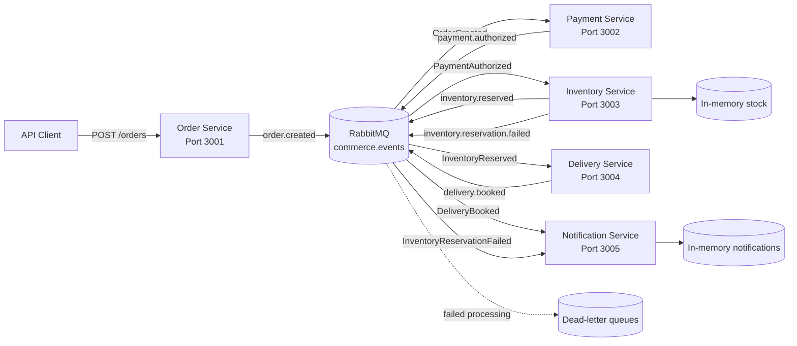
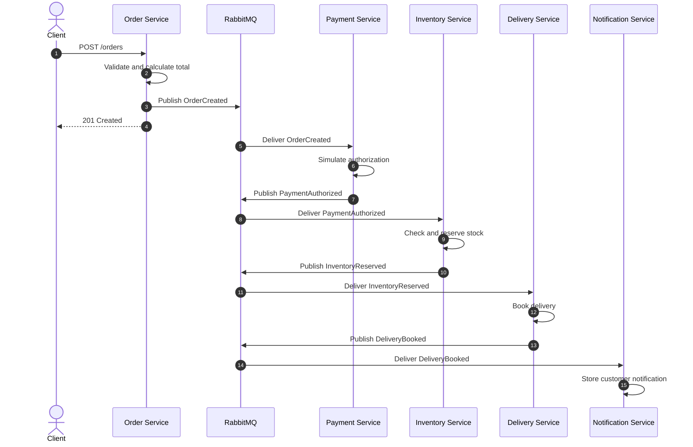
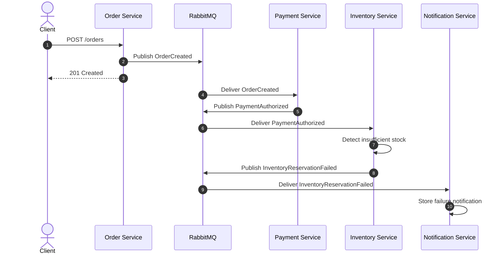

<div align="center">

# CommerceFlow

### Event-driven commerce workflow built with TypeScript, RabbitMQ and independently running services

**Node.js · TypeScript · RabbitMQ · Express · Docker · npm Workspaces**

[Overview](#overview) ·
[Architecture](#architecture) ·
[Services](#services) ·
[Getting started](#getting-started) ·
[Running the demo](#running-the-demo) ·
[Reliability](#reliability) ·
[Roadmap](#roadmap)

</div>

---

## Overview

CommerceFlow is an event-driven backend demonstration project that shows how independently running services can collaborate through asynchronous events.

The system models a simplified commerce workflow:

1. An order is created.
2. Payment is authorized.
3. Inventory attempts to reserve the requested products.
4. A delivery is booked when the reservation succeeds.
5. A customer notification is created.
6. An alternative notification is created if the inventory reservation fails.

The services do not communicate through direct service-to-service HTTP calls.

Instead, they publish and consume domain events through RabbitMQ. Each service only understands the events relevant to its own responsibility.

The project focuses on:

* Service boundaries
* Asynchronous communication
* Event contracts
* Reliability
* Loose coupling
* Failure handling
* Dependency readiness
* Runtime recovery
* Maintainable infrastructure abstractions

CommerceFlow is deliberately small enough to understand while still demonstrating patterns used in larger distributed systems.

---

## Why this project exists

Commerce workflows often cross several business and technical boundaries.

A single order can involve:

* Order registration
* Payment processing
* Inventory reservation
* Delivery planning
* Customer communication
* Auditing
* Failure recovery

A tightly coupled implementation can cause every service to depend directly on the availability, endpoint structure and implementation details of the next service.

CommerceFlow demonstrates another approach:

* Each service owns one clear business responsibility.
* Services communicate through typed events.
* Publishers do not need to know which consumers exist.
* New consumers can be added without changing existing publishers.
* Failed messages can be moved to dead-letter queues.
* Duplicate event deliveries can be detected.
* A correlation identifier follows the complete workflow.
* Services can remain alive while RabbitMQ is temporarily unavailable.
* RabbitMQ-dependent readiness is reported separately from process liveness.
* Consumer subscriptions can automatically recover after RabbitMQ becomes available again.

---

## Current workflow

### Successful order

```text
OrderCreated
    ↓
PaymentAuthorized
    ↓
InventoryReserved
    ↓
DeliveryBooked
    ↓
Customer notification stored
```

### Insufficient inventory

```text
OrderCreated
    ↓
PaymentAuthorized
    ↓
InventoryReservationFailed
    ↓
Customer notification stored
```

The Notification Service currently stores notifications in memory. It does not publish a separate `CustomerNotified` domain event.

---

## What the project demonstrates

| Area                 | Demonstrated concept                                                       |
| -------------------- | -------------------------------------------------------------------------- |
| Architecture         | Event-driven services                                                      |
| Communication        | Asynchronous RabbitMQ messaging                                            |
| Contracts            | Shared and typed TypeScript event definitions                              |
| Routing              | Topic exchange and explicit routing keys                                   |
| Reliability          | Connection retry, readiness supervision, recovery and dead-letter handling |
| Consistency          | In-process idempotent event processing                                     |
| Traceability         | Correlation identifiers across services                                    |
| Observability        | Structured JSON logging with service and workflow context                  |
| Service design       | Independent business responsibilities                                      |
| API design           | Express-based HTTP endpoints                                               |
| Health model         | Separate liveness and dependency-aware readiness endpoints                 |
| Development          | TypeScript monorepo using npm workspaces                                   |
| Local infrastructure | RabbitMQ through Docker Compose                                            |
| Automation           | GitHub Actions validation on Node.js 20 and 22                             |
| Testing              | Unit, RabbitMQ integration, workflow E2E and recovery E2E testing          |

---

## Architecture



### Architectural direction

Each service:

* Runs as an independent Node.js process.
* Owns one focused business responsibility.
* Subscribes only to relevant events.
* Publishes the result of its work as a new event when required.
* Preserves the workflow correlation identifier.
* Uses shared messaging infrastructure without sharing business behaviour.
* Exposes process liveness independently of RabbitMQ availability.
* Exposes RabbitMQ-aware workload readiness.
* Can recover its RabbitMQ dependency without restarting the process.
* Can evolve independently within the boundaries of its event contracts.

---

## Services

## Order Service

**Default port:** `3001`

The Order Service is the HTTP entry point for the workflow.

### Responsibilities

* Exposes `POST /orders`.
* Exposes `GET /health`.
* Exposes `GET /ready`.
* Validates incoming order requests.
* Generates the order identifier.
* Calculates the total order amount.
* Reads or creates a correlation identifier.
* Publishes `OrderCreated`.
* Returns the created order information to the client.

### Endpoints

| Method | Endpoint  | Purpose                                        |
| ------ | --------- | ---------------------------------------------- |
| `GET`  | `/health` | Returns process liveness information           |
| `GET`  | `/ready`  | Returns RabbitMQ dependency readiness          |
| `POST` | `/orders` | Creates an order and starts the event workflow |

The service does not call the Payment Service directly. Its responsibility ends when the order has been created and the event has been published.

---

## Payment Service

**Default port:** `3002`

The Payment Service reacts to new orders.

### Responsibilities

* Exposes `GET /health`.
* Exposes `GET /ready`.
* Subscribes to `OrderCreated`.
* Simulates payment authorization.
* Creates a payment identifier.
* Preserves the original order items.
* Publishes `PaymentAuthorized`.

### Endpoints

| Method | Endpoint  | Purpose                               |
| ------ | --------- | ------------------------------------- |
| `GET`  | `/health` | Returns process liveness information  |
| `GET`  | `/ready`  | Returns RabbitMQ dependency readiness |

Payment authorization is deliberately simulated. The purpose is to demonstrate service collaboration and event handling rather than integration with a real payment provider.

---

## Inventory Service

**Default port:** `3003`

The Inventory Service owns the current demo stock.

### Responsibilities

* Exposes `GET /health`.
* Exposes `GET /ready`.
* Exposes `GET /stock`.
* Subscribes to `PaymentAuthorized`.
* Checks every requested order item.
* Reserves stock when all products are available.
* Leaves stock unchanged when any item is unavailable.
* Publishes `InventoryReserved` on success.
* Publishes `InventoryReservationFailed` on failure.

### Endpoints

| Method | Endpoint  | Purpose                               |
| ------ | --------- | ------------------------------------- |
| `GET`  | `/health` | Returns process liveness information  |
| `GET`  | `/ready`  | Returns RabbitMQ dependency readiness |
| `GET`  | `/stock`  | Returns the current in-memory stock   |

### Initial stock

| Product              | Quantity |
| -------------------- | -------: |
| `washing-machine-01` |       10 |
| `dishwasher-01`      |        5 |
| `dryer-01`           |        3 |

Inventory is currently stored in memory and is reset whenever the service restarts.

---

## Delivery Service

**Default port:** `3004`

The Delivery Service reacts to successful inventory reservations.

### Responsibilities

* Exposes `GET /health`.
* Exposes `GET /ready`.
* Subscribes to `InventoryReserved`.
* Creates a delivery identifier.
* Selects a simulated carrier.
* Calculates an estimated delivery date.
* Publishes `DeliveryBooked`.

### Endpoints

| Method | Endpoint  | Purpose                               |
| ------ | --------- | ------------------------------------- |
| `GET`  | `/health` | Returns process liveness information  |
| `GET`  | `/ready`  | Returns RabbitMQ dependency readiness |

The current implementation uses `DefaultCarrier` and calculates the estimated delivery date as three days after the booking date.

This is intentionally simple because the project focuses on event flow rather than integration with a real shipping provider.

---

## Notification Service

**Default port:** `3005`

The Notification Service creates customer-facing notification records based on workflow outcomes.

### Responsibilities

* Exposes `GET /health`.
* Exposes `GET /ready`.
* Exposes `GET /notifications`.
* Subscribes to `DeliveryBooked`.
* Subscribes to `InventoryReservationFailed`.
* Creates a success notification when delivery is booked.
* Creates a failure notification when stock cannot be reserved.
* Stores notifications in memory.
* Preserves the workflow correlation identifier.

### Endpoints

| Method | Endpoint         | Purpose                                     |
| ------ | ---------------- | ------------------------------------------- |
| `GET`  | `/health`        | Returns process liveness information        |
| `GET`  | `/ready`         | Returns RabbitMQ dependency readiness       |
| `GET`  | `/notifications` | Returns all current in-memory notifications |

The current version does not send real email, SMS or push notifications.

---

## Event flow

### Successful workflow



### Failed inventory workflow



---

## Events

All domain events are published through the durable topic exchange:

```text
commerce.events
```

| Routing key                    | Event                        | Publisher         | Consumer             |
| ------------------------------ | ---------------------------- | ----------------- | -------------------- |
| `order.created`                | `OrderCreated`               | Order Service     | Payment Service      |
| `payment.authorized`           | `PaymentAuthorized`          | Payment Service   | Inventory Service    |
| `inventory.reserved`           | `InventoryReserved`          | Inventory Service | Delivery Service     |
| `inventory.reservation.failed` | `InventoryReservationFailed` | Inventory Service | Notification Service |
| `delivery.booked`              | `DeliveryBooked`             | Delivery Service  | Notification Service |

### Shared event envelope

Every event contains:

```ts
interface DomainEvent<TEventType, TData> {
    eventId: string;
    eventType: TEventType;
    occurredAt: string;
    correlationId: string;
    data: TData;
}
```

The envelope provides:

* A unique event identifier
* A typed event name
* A timestamp
* A workflow correlation identifier
* Event-specific data

### Event naming

Events describe facts that have already occurred and are therefore named in the past tense:

```text
OrderCreated
PaymentAuthorized
InventoryReserved
InventoryReservationFailed
DeliveryBooked
```

---

## Correlation identifiers

The Order Service reads an optional correlation identifier from:

```text
x-correlation-id
```

When the request does not contain one, the service generates a new UUID.

The same value is then carried through:

```text
OrderCreated
    ↓
PaymentAuthorized
    ↓
InventoryReserved or InventoryReservationFailed
    ↓
DeliveryBooked
    ↓
Notification record
```

This makes it possible to follow one workflow across several independently running services.

---

## Reliability

Distributed systems introduce failure cases that do not exist in the same way inside a single process.

CommerceFlow includes several mechanisms that make these scenarios visible and manageable.

### RabbitMQ connection retry

A service may start before RabbitMQ is ready.

The shared messaging client retries failed connection attempts instead of failing permanently after the first attempt.

The current defaults are:

```text
Maximum attempts: 10
Delay between attempts: 2000 milliseconds
```

The `RabbitMqSupervisor` runs the service-specific RabbitMQ initialization in the background and can retry initialization after a failed connection cycle.

---

### Liveness, readiness and RabbitMQ recovery

All five services expose separate liveness and readiness endpoints.

`GET /health` reports whether the HTTP process is alive.

It deliberately does not depend on RabbitMQ, which means the HTTP process can remain healthy while the messaging dependency is unavailable.

`GET /ready` reports whether the service is able to perform its RabbitMQ-dependent workload.

A service reports:

```text
HTTP 200
Ready
```

only after the RabbitMQ initialization required by that service has completed and the underlying RabbitMQ connection and channel remain available.

For the Order Service, initialization means establishing its RabbitMQ connection and channel.

For the consuming services, initialization also includes:

* Queue declaration
* Dead-letter topology declaration
* Routing-key bindings
* Consumer subscription setup

When RabbitMQ is unavailable:

```text
Service process alive
    ↓
/health = 200
/ready  = 503
```

The shared `RabbitMqSupervisor` monitors RabbitMQ readiness in the background.

If the RabbitMQ connection or channel is lost, the messaging client immediately becomes unready.

The supervisor then attempts to reconnect and reruns the service-specific initialization.

For consumer services, this means recreating the required subscription.

Conceptually:

```text
RabbitMQ available
    ↓
Initialization complete
    ↓
/ready = 200
    ↓
RabbitMQ unavailable
    ↓
/health = 200
/ready  = 503
    ↓
RabbitMQ becomes available again
    ↓
Reconnect
    ↓
Reinitialize subscriptions
    ↓
/ready = 200
```

This recovery behaviour is covered by a dedicated end-to-end test.

The test starts all five services while RabbitMQ is unavailable, verifies their liveness and unready state, restores RabbitMQ and verifies that the original service processes recover without being restarted.

The recovered services must then process a complete order workflow through to the final customer notification.

---

### Durable exchange and queues

The main exchange and service queues are declared as durable.

Published messages use persistent delivery mode.

This allows RabbitMQ to preserve the configured messaging topology and makes messages more resilient to broker restarts.

Persistence still depends on the complete RabbitMQ deployment and storage configuration.

---

### Explicit acknowledgements

Messages are acknowledged only after the consumer handler completes successfully.

Conceptually:

```text
Receive message
    ↓
Parse event
    ↓
Validate event identifier
    ↓
Check idempotency
    ↓
Execute handler
    ↓
Publish resulting event when required
    ↓
Mark event as processed
    ↓
Acknowledge message
```

Each consumer callback retains the RabbitMQ channel on which its subscription was created.

This ensures that an in-flight message is acknowledged or negatively acknowledged through its original subscription channel rather than a newer channel that may have been created after a reconnect.

When processing fails, the message is rejected without requeueing and is routed to the queue-specific dead-letter queue.

---

### Dead-letter handling

Each subscriber queue receives its own dead-letter queue.

The naming pattern is:

```text
<queue-name>.dead-letter
```

Examples:

```text
payment-service.order-created.dead-letter
inventory-service.payment-authorized.dead-letter
delivery-service.inventory-reserved.dead-letter
notification-service.customer-events.dead-letter
```

Failed messages can then be:

* Inspected
* Diagnosed
* Logged
* Replayed manually
* Processed by future recovery tooling

---

### Idempotent processing

RabbitMQ may redeliver a message if processing is interrupted before acknowledgement.

The shared messaging client keeps processed event identifiers per queue and acknowledges duplicate events without running the handler again.

This prevents duplicate effects during the current process lifetime, such as:

* Authorizing the same payment twice
* Reserving the same inventory twice
* Booking the same delivery twice
* Creating the same notification twice

The current idempotency store is in memory.

A production implementation should use persistent storage because the in-memory record is lost when a service restarts.

---

## Repository structure

```text
commerce-flow/
├── .github/
│   └── workflows/
│       └── ci.yml
│
├── shared/
│   ├── contracts/
│   │   ├── src/
│   │   │   ├── events.ts
│   │   │   └── index.ts
│   │   ├── package.json
│   │   └── tsconfig.json
│   │
│   ├── logging/
│   │   ├── src/
│   │   │   ├── index.ts
│   │   │   └── structuredLogger.ts
│   │   ├── tests/
│   │   │   ├── structuredLogger.test.ts
│   │   │   └── tsconfig.json
│   │   ├── package.json
│   │   └── tsconfig.json
│   │
│   └── messaging/
│       ├── src/
│       │   ├── index.ts
│       │   ├── rabbitMqClient.ts
│       │   └── rabbitMqSupervisor.ts
│       ├── tests/
│       │   ├── integration/
│       │   │   └── rabbitMqClient.integration.test.ts
│       │   ├── rabbitMqClient.test.ts
│       │   ├── rabbitMqSupervisor.test.ts
│       │   └── tsconfig.json
│       ├── package.json
│       └── tsconfig.json
│
├── services/
│   ├── order-service/
│   │   ├── src/
│   │   │   ├── app.ts
│   │   │   ├── index.ts
│   │   │   ├── orderRequestValidator.ts
│   │   │   └── orderService.ts
│   │   └── tests/
│   │       ├── orderApp.test.ts
│   │       ├── orderRequestValidator.test.ts
│   │       └── orderService.test.ts
│   │
│   ├── payment-service/
│   │   ├── src/
│   │   │   ├── app.ts
│   │   │   ├── index.ts
│   │   │   ├── orderCreatedHandler.ts
│   │   │   └── paymentService.ts
│   │   └── tests/
│   │       ├── orderCreatedHandler.test.ts
│   │       ├── paymentApp.test.ts
│   │       └── paymentService.test.ts
│   │
│   ├── inventory-service/
│   │   ├── src/
│   │   │   ├── app.ts
│   │   │   ├── index.ts
│   │   │   ├── inMemoryInventoryRepository.ts
│   │   │   ├── inventoryRepository.ts
│   │   │   ├── inventoryService.ts
│   │   │   └── paymentAuthorizedHandler.ts
│   │   └── tests/
│   │       ├── inventoryApp.test.ts
│   │       ├── inventoryService.test.ts
│   │       └── paymentAuthorizedHandler.test.ts
│   │
│   ├── delivery-service/
│   │   ├── src/
│   │   │   ├── app.ts
│   │   │   ├── deliveryService.ts
│   │   │   ├── index.ts
│   │   │   └── inventoryReservedHandler.ts
│   │   └── tests/
│   │       ├── deliveryApp.test.ts
│   │       ├── deliveryService.test.ts
│   │       └── inventoryReservedHandler.test.ts
│   │
│   └── notification-service/
│       ├── src/
│       │   ├── app.ts
│       │   ├── index.ts
│       │   ├── notificationEventHandler.ts
│       │   └── notificationService.ts
│       └── tests/
│           ├── notificationApp.test.ts
│           ├── notificationEventHandler.test.ts
│           └── notificationService.test.ts
│
├── tests/
│   ├── e2e/
│   │   ├── commerceFlow.e2e.test.ts
│   │   └── rabbitMqRecovery.e2e.test.ts
│   └── tsconfig.json
│
├── docker-compose.yml
├── package.json
├── package-lock.json
├── tsconfig.base.json
└── README.md
```

### Workspace responsibilities

| Workspace                             | Responsibility                                                         |
| ------------------------------------- | ---------------------------------------------------------------------- |
| `@commerce-flow/contracts`            | Shared event envelopes, payloads and event types                       |
| `@commerce-flow/logging`              | Structured JSON logging and contextual application logs                |
| `@commerce-flow/messaging`            | RabbitMQ connection, publishing, subscriptions, readiness and recovery |
| `@commerce-flow/order-service`        | Order creation and `OrderCreated` publishing                           |
| `@commerce-flow/payment-service`      | Payment authorization and `PaymentAuthorized` publishing               |
| `@commerce-flow/inventory-service`    | Stock reservation and inventory result events                          |
| `@commerce-flow/delivery-service`     | Delivery booking and `DeliveryBooked` publishing                       |
| `@commerce-flow/notification-service` | Customer notification creation for workflow outcomes                   |

Shared packages contain technical infrastructure and communication contracts.

Business behaviour remains inside the individual services.

---

## Technology stack

### Runtime and language

* Node.js 20 or newer
* TypeScript
* ECMAScript modules
* npm workspaces

### APIs

* Express
* JSON over HTTP
* Zod 4 runtime request validation
* Separate liveness and readiness endpoints

### Messaging

* RabbitMQ
* Topic exchange
* Durable queues
* Persistent messages
* Explicit routing keys
* Manual acknowledgements
* Dead-letter queues
* Correlation identifiers
* In-process idempotent consumers
* Connection retry
* Background dependency supervision
* Automatic reconnect and subscription reinitialization

### Logging

* Shared `@commerce-flow/logging` workspace
* Structured JSON logs
* Service and workflow context
* Structured error serialization
* Child loggers with inherited context

### Testing

* Built-in Node.js test runner
* Deterministic dependency injection
* Fake RabbitMQ connections and channels
* Service business-logic unit tests
* HTTP application component tests on dynamic local ports
* Health and readiness endpoint tests
* Event-handler component tests with injected publishers and loggers
* Messaging infrastructure unit tests
* RabbitMQ supervisor lifecycle tests
* In-flight acknowledgement/reconnect testing
* Real-broker RabbitMQ integration testing
* Isolated integration-test topology with cleanup
* Complete workflow end-to-end testing
* RabbitMQ recovery end-to-end testing
* Five independently running service processes during end-to-end testing
* HTTP assertions against public service endpoints
* Publisher failure-propagation tests
* Input immutability tests
* Defensive copy tests

### Local infrastructure

* Docker
* Docker Compose
* RabbitMQ Management UI
* RabbitMQ container health check

### Automation

* GitHub Actions
* Node.js 20 validation
* Node.js 22 validation
* Reproducible installation through `npm ci`
* Type checking
* Workspace builds
* Workspace test execution
* Docker Compose controlled RabbitMQ startup
* Integration and end-to-end validation

---

## Getting started

### Prerequisites

Install:

* Node.js 20 or newer
* npm
* Docker Desktop or another Docker-compatible runtime
* Git

Verify the installations:

```powershell
node --version
npm --version
docker --version
docker compose version
git --version
```

---

### 1. Clone the repository

```powershell
git clone https://github.com/kris7011/commerce-flow.git
cd commerce-flow
```

---

### 2. Install dependencies

```powershell
npm install
```

For a clean installation based strictly on `package-lock.json`:

```powershell
npm ci
```

---

### 3. Start RabbitMQ

```powershell
docker compose up -d --wait rabbitmq
```

Check the running container:

```powershell
docker compose ps
```

The container should report a healthy state before the services are considered fully ready.

RabbitMQ uses:

| Purpose              | Address                  |
| -------------------- | ------------------------ |
| AMQP connection      | `localhost:5672`         |
| Management interface | `http://localhost:15672` |

Default local credentials:

```text
Username: guest
Password: guest
```

These credentials are only suitable for local development.

---

### 4. Start the services

Open five terminals in the repository root.

#### Terminal 1 - Order Service

```powershell
npm run dev:order
```

#### Terminal 2 - Payment Service

```powershell
npm run dev:payment
```

#### Terminal 3 - Inventory Service

```powershell
npm run dev:inventory
```

#### Terminal 4 - Delivery Service

```powershell
npm run dev:delivery
```

#### Terminal 5 - Notification Service

```powershell
npm run dev:notification
```

### Local service addresses

| Service              | Address                  |
| -------------------- | ------------------------ |
| Order Service        | `http://localhost:3001`  |
| Payment Service      | `http://localhost:3002`  |
| Inventory Service    | `http://localhost:3003`  |
| Delivery Service     | `http://localhost:3004`  |
| Notification Service | `http://localhost:3005`  |
| RabbitMQ Management  | `http://localhost:15672` |

---

## Health and readiness checks

CommerceFlow separates process liveness from dependency readiness.

Check service liveness from PowerShell:

```powershell
Invoke-RestMethod -Uri "http://localhost:3001/health"
Invoke-RestMethod -Uri "http://localhost:3002/health"
Invoke-RestMethod -Uri "http://localhost:3003/health"
Invoke-RestMethod -Uri "http://localhost:3004/health"
Invoke-RestMethod -Uri "http://localhost:3005/health"
```

A healthy service returns a response similar to:

```json
{
  "status": "Healthy",
  "service": "order-service"
}
```

The `/health` endpoints confirm that the HTTP process is alive.

They deliberately remain independent of RabbitMQ.

Check RabbitMQ-aware readiness:

```powershell
Invoke-RestMethod -Uri "http://localhost:3001/ready"
Invoke-RestMethod -Uri "http://localhost:3002/ready"
Invoke-RestMethod -Uri "http://localhost:3003/ready"
Invoke-RestMethod -Uri "http://localhost:3004/ready"
Invoke-RestMethod -Uri "http://localhost:3005/ready"
```

A ready service returns a response similar to:

```json
{
  "status": "Ready",
  "service": "payment-service",
  "dependencies": {
    "rabbitMq": "Ready"
  }
}
```

When RabbitMQ is unavailable, the process can remain healthy while readiness returns HTTP `503` with:

```json
{
  "status": "NotReady",
  "service": "payment-service",
  "dependencies": {
    "rabbitMq": "NotReady"
  }
}
```

This distinction allows infrastructure to differentiate between:

```text
Process is alive
```

and:

```text
Service is ready to perform its RabbitMQ-dependent workload
```

---

## Running the demo

## Successful order

### 1. Inspect the initial stock

```powershell
Invoke-RestMethod `
    -Uri "http://localhost:3003/stock" `
    -Method Get
```

Expected initial stock:

```json
{
  "stock": {
    "washing-machine-01": 10,
    "dishwasher-01": 5,
    "dryer-01": 3
  }
}
```

### 2. Create an order

```powershell
$body = @{
    customerId = "customer-001"
    items = @(
        @{
            productId = "washing-machine-01"
            quantity = 1
            unitPrice = 4999.00
        }
    )
} | ConvertTo-Json -Depth 4

$orderResponse = Invoke-RestMethod `
    -Uri "http://localhost:3001/orders" `
    -Method Post `
    -ContentType "application/json" `
    -Headers @{
        "x-correlation-id" = "demo-success-001"
    } `
    -Body $body

$orderResponse
```

Expected response structure:

```json
{
  "orderId": "generated-order-id",
  "status": "Created",
  "totalAmount": 4999,
  "correlationId": "demo-success-001"
}
```

### 3. Follow the service logs

The expected progression is:

```text
Order Service
└── publishes OrderCreated

Payment Service
└── consumes OrderCreated
    └── publishes PaymentAuthorized

Inventory Service
└── consumes PaymentAuthorized
    └── publishes InventoryReserved

Delivery Service
└── consumes InventoryReserved
    └── publishes DeliveryBooked

Notification Service
└── consumes DeliveryBooked
    └── stores customer notification
```

### 4. Verify the updated stock

```powershell
Invoke-RestMethod `
    -Uri "http://localhost:3003/stock" `
    -Method Get
```

The quantity of `washing-machine-01` should now be `9`.

### 5. Inspect notifications

```powershell
Invoke-RestMethod `
    -Uri "http://localhost:3005/notifications" `
    -Method Get
```

The result should contain a delivery notification with:

* The generated order identifier
* `DeliveryBooked` as its type
* `DefaultCarrier`
* The estimated delivery date
* The original correlation identifier

---

## Failed inventory reservation

Create an order requesting more units than the current stock contains:

```powershell
$body = @{
    customerId = "customer-002"
    items = @(
        @{
            productId = "dryer-01"
            quantity = 99
            unitPrice = 2999.00
        }
    )
} | ConvertTo-Json -Depth 4

$orderResponse = Invoke-RestMethod `
    -Uri "http://localhost:3001/orders" `
    -Method Post `
    -ContentType "application/json" `
    -Headers @{
        "x-correlation-id" = "demo-failure-001"
    } `
    -Body $body

$orderResponse
```

Expected progression:

```text
OrderCreated
    ↓
PaymentAuthorized
    ↓
InventoryReservationFailed
    ↓
Failure notification stored
```

Inspect the notifications:

```powershell
Invoke-RestMethod `
    -Uri "http://localhost:3005/notifications" `
    -Method Get
```

The failed reservation notification contains:

* The affected order identifier
* `InventoryReservationFailed` as its type
* The failure reason
* Requested and available quantities
* The workflow correlation identifier

The stock remains unchanged when the reservation fails.

---

## Validation commands

### Type checking

```powershell
npm run typecheck
```

This executes the `typecheck` script in every workspace that defines one and also type-checks the end-to-end test suite.

Type checking detects issues such as:

* Invalid event payloads
* Missing event properties
* Incorrect imports
* Contract mismatches
* Invalid function arguments
* Incompatible return types

---

### Build

```powershell
npm run build
```

This compiles all workspaces that define a build script.

---

### Tests

```powershell
npm test
```

The root command executes test scripts in workspaces where they exist.

All five services, the shared messaging client, RabbitMQ supervisor and shared logging package include unit and component tests for their isolated behaviour.

| Workspace            |  Tests | Covered behaviour                                                                                                                                                                                                  |
| -------------------- | -----: | ------------------------------------------------------------------------------------------------------------------------------------------------------------------------------------------------------------------ |
| Logging              |      5 | JSON serialization, log levels, error serialization, child loggers and inherited context                                                                                                                           |
| Messaging            |     23 | Connection lifecycle and retry, readiness, publishing, queue and dead-letter topology, acknowledgements, duplicate handling, reconnection, supervisor recovery, subscription-channel safety and structured logging |
| Order Service        |     13 | Zod request validation, correlation identifiers, totals, event creation, health and readiness endpoints, publishing and structured request logging                                                                 |
| Payment Service      |      8 | Payment event creation, data preservation, health and readiness endpoints, structured event coordination and publisher failure propagation                                                                         |
| Inventory Service    |     11 | Reservation rules, health, readiness and stock endpoints, structured success and failure logging and publisher failure propagation                                                                                 |
| Delivery Service     |      9 | Delivery creation, date calculation, health and readiness endpoints, structured event coordination, workflow identifiers and publisher failure propagation                                                         |
| Notification Service |     11 | Notification creation, defensive copies, health, readiness and notification endpoints, both event-handler paths and structured logging                                                                             |
| **Total**            | **80** |                                                                                                                                                                                                                    |

These tests do not require RabbitMQ or separately running service processes.

The HTTP application tests create temporary in-process Express servers on dynamic ports and close them after each test.

The event-handler tests inject recording publishers and loggers to verify coordination, produced results and failure propagation without RabbitMQ.

The messaging tests use fake connection and channel implementations to verify `RabbitMqClient`, connection lifecycle behaviour and `RabbitMqSupervisor` readiness and recovery behaviour.

The tests also cover the reconnect edge case where an in-flight message must remain associated with the RabbitMQ channel that originally delivered it.

The logging tests verify structured JSON serialization, log levels, error serialization and inherited child-logger context.

---

### RabbitMQ integration test

```powershell
npm run test:integration
```

The integration test runs two independent `RabbitMqClient` instances against a real RabbitMQ broker:

* One subscriber
* One publisher

It verifies:

* Exchange, queue and dead-letter topology creation
* Topic routing through RabbitMQ
* Complete event payload preservation
* `messageId` mapped from `eventId`
* Correlation identifier preservation
* JSON content type
* Persistent message delivery mode
* Cleanup of test-specific queues and exchanges

The integration test requires RabbitMQ to be running locally or available through the `RABBITMQ_URL` environment variable.

---

### End-to-end tests

```powershell
npm run test:e2e
```

The root end-to-end command runs two tests sequentially:

```text
Workflow E2E
    ↓
RabbitMQ recovery E2E
```

### Workflow end-to-end test

```powershell
npm run test:e2e:workflow
```

The workflow test starts all five services as independent Node.js processes and uses a real RabbitMQ broker.

The test interacts with the system only through its public HTTP endpoints:

* `POST /orders` starts the workflow.
* `GET /notifications` verifies the final customer-facing result.
* `GET /stock` verifies successful and failed inventory effects.

The test covers both complete workflow outcomes:

```text
Successful order
    ↓
OrderCreated
    ↓
PaymentAuthorized
    ↓
InventoryReserved
    ↓
DeliveryBooked
    ↓
DeliveryBooked notification
```

and:

```text
Insufficient inventory
    ↓
OrderCreated
    ↓
PaymentAuthorized
    ↓
InventoryReservationFailed
    ↓
InventoryReservationFailed notification
```

It also verifies that successful reservations reduce stock and failed reservations leave stock unchanged.

The workflow-test services use test-specific ports `3101` through `3105` and are stopped after the test completes.

---

### RabbitMQ recovery end-to-end test

```powershell
npm run test:e2e:recovery
```

The recovery test verifies dependency lifecycle behaviour rather than only the normal workflow.

It:

1. Stops RabbitMQ.
2. Waits for the broker port to become unavailable.
3. Starts all five service processes.
4. Verifies that every `/health` endpoint returns HTTP `200`.
5. Verifies that every `/ready` endpoint returns HTTP `503`.
6. Records the original service process identifiers.
7. Starts RabbitMQ again through Docker Compose.
8. Waits for the broker to become healthy and reachable.
9. Waits for every `/ready` endpoint to return HTTP `200`.
10. Verifies that the original service processes remained running.
11. Creates an order.
12. Verifies that the recovered system processes the order through to a `DeliveryBooked` notification.

Conceptually:

```text
RabbitMQ unavailable
    ↓
Start five services
    ↓
/health = 200
/ready  = 503
    ↓
Start RabbitMQ
    ↓
Reconnect and reinitialize
    ↓
/ready = 200
    ↓
Same service processes remain alive
    ↓
Create order
    ↓
OrderCreated
    ↓
PaymentAuthorized
    ↓
InventoryReserved
    ↓
DeliveryBooked
    ↓
Customer notification
```

The recovery-test services use test-specific ports `3201` through `3205`.

RabbitMQ is controlled through Docker Compose during this test and is restored to a running healthy state during cleanup.

---

### Dependency audit

```powershell
npm audit
```

The repository currently uses a patched `body-parser` dependency and should report no known vulnerabilities for the installed dependency tree.

---

## Continuous integration

The GitHub Actions workflow is located at:

```text
.github/workflows/ci.yml
```

It runs for:

* Pushes to `main`
* Pull requests targeting `main`
* Manual workflow execution

The workflow validates the project on:

```text
Node.js 20.x
Node.js 22.x
```

Each matrix job performs:

```text
Checkout repository
    ↓
Set up Node.js
    ↓
npm ci
    ↓
npm run typecheck
    ↓
npm run build
    ↓
npm test
    ↓
docker compose up -d --wait rabbitmq
    ↓
npm run test:integration
    ↓
npm run test:e2e
    ↓
docker compose down
```

The jobs use:

* Read-only repository permissions
* npm dependency caching
* RabbitMQ managed through Docker Compose
* Health-gated RabbitMQ startup through Docker Compose
* A ten-minute timeout
* Cancellation of outdated workflow runs on the same reference
* Independent reporting for both Node.js versions
* Unit and component validation
* Real RabbitMQ integration validation
* Complete workflow end-to-end validation
* RabbitMQ dependency recovery validation through five independently running services

---

## Engineering decisions

### Why asynchronous events?

Direct HTTP communication would make each service depend on:

* The next service being online
* The next service’s network location
* Its HTTP endpoint structure
* Its response format
* Its implementation details

With events, the Order Service only needs to know how to publish `OrderCreated`.

It does not need to know:

* Where the Payment Service runs
* Whether the Payment Service is currently available
* Which other consumers use the same event
* How payment authorization is implemented

---

### Why RabbitMQ?

RabbitMQ provides the messaging capabilities required by the project without introducing excessive infrastructure complexity.

Relevant features include:

* Exchanges
* Queues
* Topic routing
* Durable topology
* Message acknowledgement
* Redelivery
* Dead-letter exchanges
* Persistent messages
* A local management interface

---

### Why a topic exchange?

The topic exchange routes events through explicit routing keys:

```text
order.created
payment.authorized
inventory.reserved
inventory.reservation.failed
delivery.booked
```

This makes the business meaning visible and allows consumers to subscribe to exact events or broader patterns.

Example:

```text
inventory.*
```

---

### Why shared contracts?

Without shared contracts, publishers and consumers could silently disagree about event payloads.

The contracts workspace provides:

* Shared event names
* Shared TypeScript payload types
* A consistent event envelope
* Compile-time feedback when a contract changes

It contains communication definitions, not shared business behaviour.

---

### Why a shared messaging package?

RabbitMQ connection and channel management are infrastructure concerns.

The messaging workspace centralizes:

* Connection retry
* Exchange creation
* Queue creation
* Queue binding
* Message publication
* Message consumption
* Acknowledgement
* Dead-letter configuration
* Duplicate event detection
* Connection lifecycle tracking
* Dependency readiness
* Background RabbitMQ supervision
* Reconnection
* Subscription reinitialization
* Connection shutdown

This avoids duplicating the same infrastructure code in every service.

The messaging client accepts replaceable infrastructure dependencies so its behaviour can be tested without starting a real RabbitMQ broker.

The normal application code still creates the client with:

```ts
const rabbitMq = new RabbitMqClient(rabbitMqUrl);
```

Unit tests can instead inject:

* A fake RabbitMQ connection
* A fake RabbitMQ channel
* A deterministic delay function
* A silent test logger

This keeps normal runtime behaviour unchanged while allowing retry, routing, acknowledgement and failure handling to be tested deterministically.

---

### Why dependency injection in the messaging client?

The real RabbitMQ connection is an external dependency.

If the client called `amqplib.connect` directly with no replacement option, every test would require:

* Docker
* A running RabbitMQ broker
* Available network ports
* Correct credentials
* Queue cleanup between tests

Dependency injection allows unit tests to replace external infrastructure while testing the client’s own decisions.

The messaging unit tests verify:

* Connection reuse
* Connection retries
* Retry exhaustion
* Connection and channel readiness
* Exchange declarations
* Event serialization
* Persistent message metadata
* Queue bindings
* Dead-letter routing
* Successful acknowledgements
* Negative acknowledgements
* Duplicate event handling
* Resource shutdown and reconnection
* Stale connection cleanup
* Subscription-channel acknowledgement safety
* Supervisor initialization state
* Supervisor recovery after readiness loss
* Initialization retry behaviour

These tests do not replace RabbitMQ integration tests.

They test the application’s messaging logic independently of RabbitMQ itself.

---

### Why separate HTTP setup from process startup?

Each service keeps application construction separate from process startup.

The structure follows three responsibilities:

* `app.ts` creates the Express application and registers its HTTP routes without listening on a fixed port.
* Event-consuming services use dedicated handler modules to coordinate domain logic, event publication and logging.
* `index.ts` acts as the composition root and owns environment variables, concrete RabbitMQ adapters, supervisor configuration, subscriptions, port binding and process signals.

The Order Service receives its work through HTTP rather than a RabbitMQ subscription. Its `app.ts` therefore receives an injected `OrderCreatedPublisher` instead of using a message-consumer handler.

This separation provides several benefits:

* HTTP behaviour can be tested without starting the complete service process.
* Tests can bind Express to an available dynamic port.
* Readiness can be tested through an injected readiness probe.
* Event handlers can use fake publishers and recording loggers.
* RabbitMQ routing keys remain infrastructure details in the composition root.
* Importing application code does not automatically connect to RabbitMQ or terminate the process.
* Business and coordination behaviour can be validated independently of process lifecycle concerns.

The result is a clearer boundary between application behaviour and runtime infrastructure.

---

### Why separate liveness and readiness?

A process can be running correctly even when one of its external dependencies is temporarily unavailable.

Treating those two states as the same thing would make it difficult for infrastructure and operators to distinguish between:

```text
The process has failed
```

and:

```text
The process is alive but temporarily unable to perform its RabbitMQ workload
```

CommerceFlow therefore uses:

```text
/health
```

for process liveness and:

```text
/ready
```

for RabbitMQ-dependent workload readiness.

This also allows a service to stay alive while RabbitMQ is unavailable and recover automatically when the broker becomes available again.

---

### Why a RabbitMQ supervisor?

A fixed number of connection attempts during process startup is not sufficient for runtime resilience.

RabbitMQ can become unavailable after a service has already started.

The `RabbitMqSupervisor` therefore owns the recurring dependency-initialization lifecycle.

For the Order Service, the supervised initialization establishes the RabbitMQ connection.

For consumer services, the supervised initialization recreates the complete subscription.

The supervisor reports ready only when:

```text
Service-specific initialization completed
                AND
RabbitMqClient is still ready
```

If readiness is lost, the supervisor can run the initialization again.

This allows the service process to remain alive during a broker outage and recover without a process restart.

---

### Why a monorepo?

The monorepo keeps the demonstration easy to install, run and inspect.

Benefits include:

* One dependency installation
* Shared TypeScript configuration
* Atomic contract changes
* Consistent scripts
* Easier local development
* One repository containing the complete workflow

The services still run as separate processes.

---

### Why in-memory storage?

Inventory, processed event identifiers and notifications are currently stored in memory.

This keeps the project focused on messaging and service collaboration.

It is an intentional limitation rather than a recommended production design.

A production implementation would require:

* Persistent databases
* Transactions
* Concurrency control
* Durable idempotency records
* Recovery after restarts
* Data migrations
* Backup and restore procedures

---

## Current limitations

CommerceFlow is an architectural demonstration rather than a production-ready commerce platform.

The current implementation does not yet include:

* Persistent business data
* Durable idempotency
* Transactional coordination between business state and event publication
* Transactional outbox
* Transactional inbox
* Real payment integration
* Real carrier integration
* Real email, SMS or push notifications
* Authentication
* Authorization
* Rate limiting
* Event schema versioning
* Distributed tracing
* Centralized metrics
* Centralized log aggregation
* Retry queues with delayed retries
* Automated dead-letter replay
* Production secret management
* Docker images for the application services
* Kubernetes deployment

The RabbitMQ recovery mechanism also remains intentionally simpler than a full production messaging platform.

For example, connection initialization is not currently cancellation-aware and concurrent connection attempts are not explicitly serialized through a shared in-flight connection promise.

The current inventory implementation also changes its in-memory stock before publishing the resulting event. Without transactional persistence and an outbox, a publication failure can therefore create consistency risks that a production implementation would need to solve.

---

## Production considerations

### Transactional outbox

A database transaction and a RabbitMQ publication cannot normally be committed atomically.

Without an outbox, a service can:

1. Save its business state.
2. Fail before publishing its event.
3. Leave downstream services unaware of the completed change.

A transactional outbox would store the business change and outgoing event in the same database transaction.

---

### Durable idempotency

Processed event identifiers should be stored in persistent storage.

The current in-memory implementation loses its state whenever a service restarts.

---

### Event versioning

Contracts must be able to evolve without unexpectedly breaking existing consumers.

A future version should define rules for:

* Backward-compatible additions
* Breaking changes
* Event version numbers
* Consumer migrations
* Deprecated event contracts

---

### Observability

CommerceFlow already includes structured JSON logging and RabbitMQ-aware readiness checks.

A more production-oriented observability setup should extend this with:

* OpenTelemetry
* Distributed traces
* Service metrics
* Queue depth monitoring
* Dead-letter alerts
* Centralized log aggregation
* Readiness aggregation across additional critical dependencies

---

### Security

A deployed environment should include:

* Secret management
* TLS
* Restricted RabbitMQ accounts
* Restricted management interface access
* Authentication
* Authorization
* Request size limits
* Dependency scanning
* Container image scanning

---

## Roadmap

### Current foundation

* [x] TypeScript monorepo
* [x] npm workspaces
* [x] Shared event contracts
* [x] Shared RabbitMQ client
* [x] Order Service
* [x] Payment Service
* [x] Inventory Service
* [x] Delivery Service
* [x] Notification Service
* [x] Topic-based event routing
* [x] Correlation identifiers
* [x] RabbitMQ connection retry
* [x] Queue-specific dead-letter handling
* [x] In-memory idempotent message handling
* [x] Health endpoints for all services
* [x] Dependency-aware RabbitMQ readiness endpoints
* [x] Background RabbitMQ recovery supervision
* [x] RabbitMQ recovery without service restart
* [x] Docker Compose environment
* [x] RabbitMQ Docker health check
* [x] Type checking
* [x] Workspace builds
* [x] Unit tests for all service business logic
* [x] HTTP application tests for all services
* [x] Event-handler component tests for all consuming services
* [x] HTTP setup separated from process startup
* [x] Unit tests for the shared RabbitMQ client
* [x] Unit tests for the RabbitMQ supervisor
* [x] RabbitMQ integration test against a real broker
* [x] RabbitMQ integration testing in GitHub Actions
* [x] Complete successful workflow end-to-end test
* [x] Complete failed inventory workflow end-to-end test
* [x] RabbitMQ recovery end-to-end test
* [x] End-to-end testing in GitHub Actions
* [x] GitHub Actions validation
* [x] Node.js 20 and 22 CI matrix
* [x] Dependency vulnerability remediation
* [x] Runtime request validation with Zod
* [x] Structured JSON logging across messaging and all services
* [x] Subscription-channel acknowledgement safety after reconnect

### Next improvements

* [ ] Add persistent inventory storage
* [ ] Add persistent notification storage
* [ ] Add persistent idempotency records
* [ ] Add retry queues with controlled delays
* [ ] Serialize concurrent RabbitMQ connection attempts
* [ ] Add cancellation-aware RabbitMQ initialization

### Advanced reliability

* [ ] Add PostgreSQL
* [ ] Add transactional outbox
* [ ] Add transactional inbox
* [ ] Add message replay tooling
* [ ] Add event contract versioning
* [ ] Add compensating actions
* [ ] Explore saga orchestration
* [ ] Explore saga choreography

### Observability and deployment

* [ ] Add OpenTelemetry
* [ ] Add distributed tracing
* [ ] Add Prometheus metrics
* [ ] Add Grafana dashboards
* [ ] Add application service container health checks
* [ ] Add Dockerfiles for all services
* [ ] Add Kubernetes manifests
* [ ] Add deployment documentation

---

## Useful commands

### Install dependencies

```powershell
npm install
```

### Clean dependency installation

```powershell
npm ci
```

### Start RabbitMQ and wait for health

```powershell
docker compose up -d --wait rabbitmq
```

### View RabbitMQ status

```powershell
docker compose ps
```

### View RabbitMQ logs

```powershell
docker compose logs -f rabbitmq
```

### Stop RabbitMQ

```powershell
docker compose down
```

### Stop RabbitMQ and remove volumes

```powershell
docker compose down --volumes
```

### Start Order Service

```powershell
npm run dev:order
```

### Start Payment Service

```powershell
npm run dev:payment
```

### Start Inventory Service

```powershell
npm run dev:inventory
```

### Start Delivery Service

```powershell
npm run dev:delivery
```

### Start Notification Service

```powershell
npm run dev:notification
```

### Run type checking

```powershell
npm run typecheck
```

### Build all workspaces

```powershell
npm run build
```

### Run all unit and component tests

```powershell
npm test
```

### Run RabbitMQ integration test

RabbitMQ must be running locally before this command is executed.

```powershell
npm run test:integration
```

### Run all end-to-end tests

RabbitMQ should initially be running through the repository's Docker Compose environment.

The workflow test runs first. The recovery test then stops and restarts RabbitMQ automatically.

```powershell
npm run test:e2e
```

### Run workflow end-to-end test only

```powershell
npm run test:e2e:workflow
```

### Run RabbitMQ recovery end-to-end test only

The recovery test controls RabbitMQ through Docker Compose and restores it during cleanup.

```powershell
npm run test:e2e:recovery
```

### Run Messaging unit tests

```powershell
npm test --workspace=@commerce-flow/messaging
```

### Run Order Service tests

```powershell
npm test --workspace=@commerce-flow/order-service
```

### Run Payment Service tests

```powershell
npm test --workspace=@commerce-flow/payment-service
```

### Run Inventory Service tests

```powershell
npm test --workspace=@commerce-flow/inventory-service
```

### Run Delivery Service tests

```powershell
npm test --workspace=@commerce-flow/delivery-service
```

### Run Notification Service tests

```powershell
npm test --workspace=@commerce-flow/notification-service
```

### Audit dependencies

```powershell
npm audit
```

---

## Troubleshooting

### A service cannot connect to RabbitMQ

Check whether RabbitMQ is running:

```powershell
docker compose ps
```

Inspect the logs:

```powershell
docker compose logs rabbitmq
```

Restart RabbitMQ:

```powershell
docker compose down
docker compose up -d --wait rabbitmq
```

Services supervise RabbitMQ in the background.

They can remain alive while RabbitMQ is unavailable and automatically attempt to reconnect and reinitialize their RabbitMQ dependency when the broker becomes available again.

While RabbitMQ is unavailable, `/health` can remain HTTP `200` while `/ready` reports HTTP `503`.

---

### A service is healthy but not ready

Check:

```powershell
Invoke-RestMethod -Uri "http://localhost:3001/health"
```

and:

```powershell
curl.exe -i http://localhost:3001/ready
```

A healthy but unready service generally means that the process itself is running but its RabbitMQ dependency has not completed initialization.

Check RabbitMQ:

```powershell
docker compose ps
```

and inspect service and RabbitMQ logs if readiness does not recover automatically.

---

### A port is already in use

Check whether another process is using one of these ports:

```text
3001
3002
3003
3004
3005
5672
15672
```

Stop the conflicting process or override the relevant service port environment variable.

---

### Messages are published but not consumed

Check:

1. Whether all five services are running.
2. Whether RabbitMQ is available.
3. Whether the relevant services report `/ready` as ready.
4. Whether the expected queues have been declared.
5. Whether the queues have the correct routing-key bindings.
6. Whether the consumer logs contain a processing error.
7. Whether the message was moved to a dead-letter queue.
8. Whether the event payload matches the shared contract.

---

### Stock or notifications disappear after restart

This is expected.

The Inventory Service and Notification Service currently use in-memory storage.

Persistent storage is planned as a future improvement.

---

### A duplicate message is processed after restart

The current duplicate-event tracking is stored in memory.

It prevents duplicates while the service process remains running but does not survive a restart.

Durable inbox or idempotency storage is planned.

---

## Learning outcomes

CommerceFlow demonstrates practical experience with:

* Decomposing workflows into service responsibilities
* Designing asynchronous event chains
* Defining typed event contracts
* Using RabbitMQ exchanges, queues and routing keys
* Preserving correlation identifiers
* Handling failed messages through dead-letter queues
* Planning for duplicate message delivery
* Separating infrastructure from business behaviour
* Separating process liveness from dependency readiness
* Designing background dependency recovery
* Reconnecting and recreating RabbitMQ subscriptions
* Preserving subscription-channel semantics during reconnect
* Separating HTTP application setup, event handling and process startup
* Testing Express applications on dynamic local ports
* Testing event handlers with injected publishers and loggers
* Applying dependency injection to infrastructure code
* Testing retry and failure behaviour deterministically
* Testing message acknowledgements and dead-letter decisions
* Testing RabbitMQ recovery without restarting service processes
* Creating independently running services in a monorepo
* Using Docker Compose to manage test infrastructure
* Using GitHub Actions for repeatable validation
* Identifying the differences between unit, integration and end-to-end tests
* Identifying the differences between liveness and readiness
* Identifying the differences between a demonstration and a production system

---

## Project status

CommerceFlow is under active development as a portfolio and architectural learning project.

The current version demonstrates a complete event-driven workflow from order creation through payment, inventory, delivery and customer notification.

Service business logic, HTTP applications, event handlers, the shared messaging client, RabbitMQ supervisor and shared logging package are covered by **80 unit and component tests**.

A RabbitMQ integration test verifies publishing, routing, consumption and message metadata against a real broker.

The workflow end-to-end test starts all five services and verifies both the successful delivery workflow and failed inventory workflow through public HTTP endpoints and RabbitMQ.

A separate RabbitMQ recovery end-to-end test verifies that all five services remain alive and report themselves unready while RabbitMQ is unavailable, then automatically recover their readiness and process a complete workflow when RabbitMQ becomes available again without restarting the service processes.

Unit, integration and both end-to-end tests run automatically in GitHub Actions on Node.js 20 and 22.

All five services separate HTTP application construction from process startup.

Event-consuming services also isolate their message coordination in dedicated, dependency-injected handler modules.

The Order Service validates incoming `POST /orders` payloads at runtime with a Zod schema before passing typed data into the business service.

Messaging and all five services use the shared structured logger to emit JSON logs with service, event and workflow context such as event identifiers, order identifiers and correlation identifiers.

The shared messaging layer now tracks RabbitMQ connection readiness, supervises runtime initialization, automatically retries after dependency loss and recreates consumer subscriptions after RabbitMQ recovery.

The project deliberately remains an architectural demonstration rather than a production-ready commerce platform.

Future iterations will focus on durable persistence, observability, transactional consistency and stronger delivery guarantees.

---

## Author

Created by **Kris Riisgaard Larsen**.

CommerceFlow is part of a software development portfolio focused on backend engineering, integrations, distributed systems and maintainable application architecture.