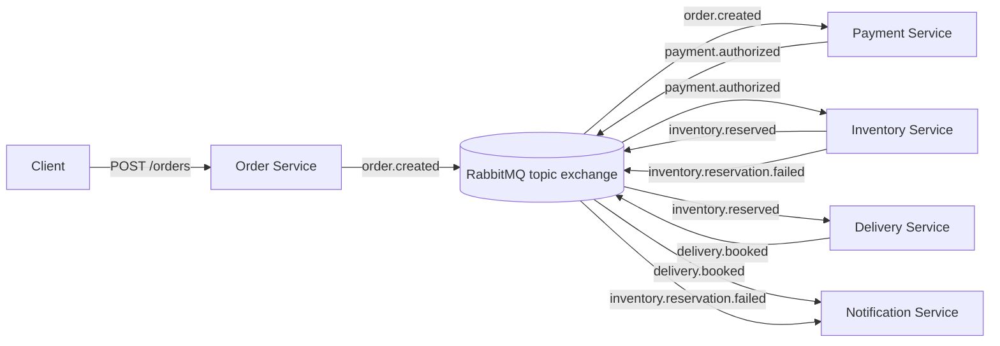

# CommerceFlow

CommerceFlow is a backend demo project built to demonstrate event-driven microservice architecture in an e-commerce domain.

The project models a simplified order flow where services communicate through asynchronous domain events using RabbitMQ instead of direct service-to-service HTTP calls.

The goal is not to build a complete webshop, but to demonstrate backend engineering concepts such as service boundaries, domain events, asynchronous messaging, reliability patterns, and traceability across distributed services.

## What the project demonstrates

CommerceFlow demonstrates:

- Event-driven microservice architecture
- Backend service boundaries
- Domain events
- RabbitMQ topic exchange and routing keys
- Asynchronous communication between services
- Shared event contracts
- Correlation IDs for tracing
- Dead-letter queues for failed messages
- RabbitMQ connection retry handling
- Idempotent message handling
- A simple e-commerce order flow

## Current architecture

The system currently contains five services:

| Service              | Responsibility                                                                                   |
| -------------------- | ------------------------------------------------------------------------------------------------ |
| Order Service        | Receives order requests and publishes `OrderCreated`                                             |
| Payment Service      | Listens to `OrderCreated` and publishes `PaymentAuthorized`                                      |
| Inventory Service    | Listens to `PaymentAuthorized` and publishes `InventoryReserved` or `InventoryReservationFailed` |
| Delivery Service     | Listens to `InventoryReserved` and publishes `DeliveryBooked`                                    |
| Notification Service | Listens to `DeliveryBooked` and `InventoryReservationFailed` and creates customer notifications  |

## Event flow

Successful order flow:

```text
POST /orders
  -> Order Service
  -> OrderCreated
  -> Payment Service
  -> PaymentAuthorized
  -> Inventory Service
  -> InventoryReserved
  -> Delivery Service
  -> DeliveryBooked
  -> Notification Service
  -> Customer notification
```

Failure flow when inventory cannot be reserved:

```text
POST /orders
  -> Order Service
  -> OrderCreated
  -> Payment Service
  -> PaymentAuthorized
  -> Inventory Service
  -> InventoryReservationFailed
  -> Notification Service
  -> Customer notification
```

## Architecture diagram



## Why event-driven architecture?

In a direct HTTP-based flow, the Order Service might need to call several downstream services:

```text
Order Service
  -> Payment Service
  -> Inventory Service
  -> Delivery Service
  -> Notification Service
```

That creates tight coupling. The Order Service would need to know which services exist and when to call them.

In this project, the Order Service only publishes an event:

```text
OrderCreated
```

Other services can react independently.

This makes the system easier to extend. For example, Notification Service was added later by subscribing to existing events without changing Order Service, Payment Service, Inventory Service, or Delivery Service.

## Domain events

A domain event represents something important that has happened in the business domain.

Current events:

| Event                        | Meaning                               |
| ---------------------------- | ------------------------------------- |
| `OrderCreated`               | An order has been created             |
| `PaymentAuthorized`          | Payment has been authorized           |
| `InventoryReserved`          | Stock has been reserved for the order |
| `InventoryReservationFailed` | Stock could not be reserved           |
| `DeliveryBooked`             | Delivery has been booked              |

## RabbitMQ setup

The project uses RabbitMQ as a message broker.

Main exchange:

```text
commerce.events
```

Exchange type:

```text
topic
```

Routing keys:

```text
order.created
payment.authorized
inventory.reserved
inventory.reservation.failed
delivery.booked
```

Each service owns its own queue.

Example:

```text
payment-service.order-created
inventory-service.payment-authorized
delivery-service.inventory-reserved
notification-service.customer-events
```

## Reliability patterns

### Connection retry

Services may start before RabbitMQ is ready to accept AMQP connections.

The shared RabbitMQ client retries the initial connection several times before failing.

This prevents services from crashing immediately when Docker has started the container, but RabbitMQ is still initializing.

### Dead-letter queues

Each consumer queue is configured with a dead-letter queue.

If a message cannot be processed, for example because the payload is invalid JSON, the message is rejected without requeueing and RabbitMQ moves it to a dead-letter queue.

Example:

```text
payment-service.order-created
  -> payment-service.order-created.dead-letter
```

This makes failed messages inspectable instead of silently losing them.

### Idempotent message handling

Messages in distributed systems may be delivered more than once.

The shared RabbitMQ client tracks processed event IDs per queue. If the same event ID is received again on the same queue, the message is acknowledged without running the handler again.

This prevents duplicate side effects such as:

- duplicate payment authorization
- duplicate stock reservation
- duplicate delivery booking
- duplicate customer notifications

Current implementation is in-memory and intended to demonstrate the principle.

A production version should persist processed event IDs in the service database using a unique constraint.

## Correlation IDs

Each event contains a `correlationId`.

This makes it possible to trace one business flow across multiple services.

Example:

```text
demo-correlation-005
```

The same correlation ID is passed through:

```text
OrderCreated
  -> PaymentAuthorized
  -> InventoryReserved
  -> DeliveryBooked
```

## Tech stack

- Node.js
- TypeScript
- Express
- RabbitMQ
- Docker Compose
- npm workspaces

## Requirements

You need:

- Node.js 20 or newer
- npm
- Docker Desktop

Check versions:

```bash
node -v
npm -v
docker version
```

## Running locally

Install dependencies:

```bash
npm install
```

Start RabbitMQ:

```bash
docker compose up -d
```

If RabbitMQ was just started, wait a few seconds before starting services.

Start services in separate terminals:

```bash
npm run dev:payment
npm run dev:inventory
npm run dev:delivery
npm run dev:notification
npm run dev:order
```

Consumer services should be started before Order Service so their queues and bindings exist before new events are published.

## Health checks

```bash
curl http://localhost:3001/health
curl http://localhost:3002/health
curl http://localhost:3003/health
curl http://localhost:3004/health
curl http://localhost:3005/health
```

Service ports:

| Service              | Port |
| -------------------- | ---- |
| Order Service        | 3001 |
| Payment Service      | 3002 |
| Inventory Service    | 3003 |
| Delivery Service     | 3004 |
| Notification Service | 3005 |

## Create an order

PowerShell example:

```powershell
$body = @{
    customerId = "customer-1004"
    items = @(
        @{
            productId = "dishwasher-01"
            quantity = 1
            unitPrice = 3499
        }
    )
} | ConvertTo-Json -Depth 5

Invoke-RestMethod `
  -Method Post `
  -Uri "http://localhost:3001/orders" `
  -Headers @{
      "content-type" = "application/json"
      "x-correlation-id" = "demo-correlation-005"
  } `
  -Body $body
```

Expected response:

```json
{
  "orderId": "...",
  "status": "Created",
  "totalAmount": 3499,
  "correlationId": "demo-correlation-005"
}
```

## Check notifications

```powershell
Invoke-RestMethod http://localhost:3005/notifications
```

After a successful order, Notification Service should contain a `DeliveryBooked` notification.

## Test inventory failure

```powershell
$body = @{
    customerId = "customer-1005"
    items = @(
        @{
            productId = "dryer-01"
            quantity = 99
            unitPrice = 3999
        }
    )
} | ConvertTo-Json -Depth 5

Invoke-RestMethod `
  -Method Post `
  -Uri "http://localhost:3001/orders" `
  -Headers @{
      "content-type" = "application/json"
      "x-correlation-id" = "demo-correlation-006"
  } `
  -Body $body
```

This should result in:

```text
InventoryReservationFailed
  -> Notification Service
```

## RabbitMQ management UI

RabbitMQ UI:

```text
http://localhost:15672
```

Login:

```text
guest / guest
```

Useful areas to inspect:

- Exchanges
- Queues
- Bindings
- Dead-letter queues
- Message counts

## Type checking

```bash
npm run typecheck
```

## Project structure

```text
commerce-flow/
├── docker-compose.yml
├── package.json
├── tsconfig.base.json
├── README.md
├── shared/
│   ├── contracts/
│   │   └── src/
│   │       ├── events.ts
│   │       └── index.ts
│   └── messaging/
│       └── src/
│           ├── rabbitMqClient.ts
│           └── index.ts
└── services/
    ├── order-service/
    ├── payment-service/
    ├── inventory-service/
    ├── delivery-service/
    └── notification-service/
```

## Current limitations

The project intentionally keeps some parts simple.

Current limitations:

- No persistent databases yet
- Inventory stock is stored in memory
- Notifications are stored in memory
- Idempotency is in-memory and does not survive service restart
- No transactional outbox yet
- No automated tests yet
- No real payment provider
- No real delivery provider
- No real email/SMS integration

## Planned improvements

Possible next iterations:

- Add PostgreSQL persistence per service
- Add transactional outbox for reliable event publishing
- Persist processed event IDs for durable idempotency
- Add automated tests
- Add structured logging
- Add OpenTelemetry tracing
- Add Dockerfiles for running services in containers
- Add retry policies for failed message handling
- Add replay tooling for dead-letter messages

## Interview explanation

Short explanation:

```text
CommerceFlow is a small e-commerce backend demo built with Node.js, TypeScript and RabbitMQ.

The project demonstrates event-driven microservice architecture through a simplified order flow. Order Service publishes OrderCreated, Payment Service reacts with PaymentAuthorized, Inventory Service reserves stock, Delivery Service books delivery, and Notification Service reacts to customer-facing outcomes.

I built it step by step to show the evolution of the architecture instead of pushing one large finished project. Later commits add reliability patterns such as RabbitMQ connection retry, dead-letter queues and idempotent message handling.

The current version is intentionally simple in terms of persistence, but it demonstrates the backend concepts I wanted to focus on: service boundaries, asynchronous events, loose coupling and reliability concerns in distributed systems.
```