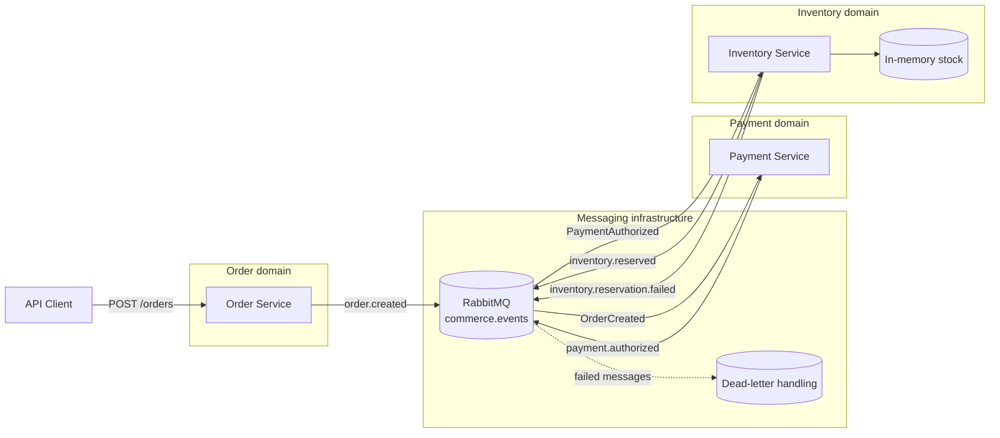
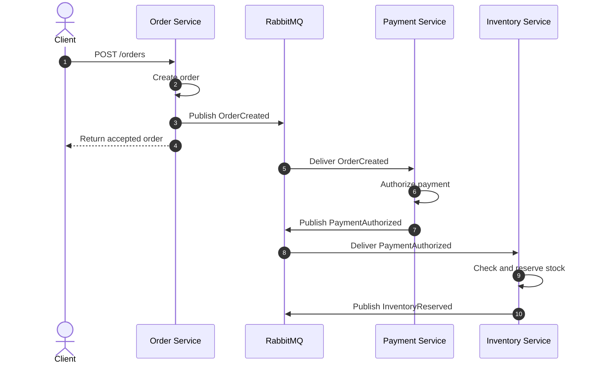
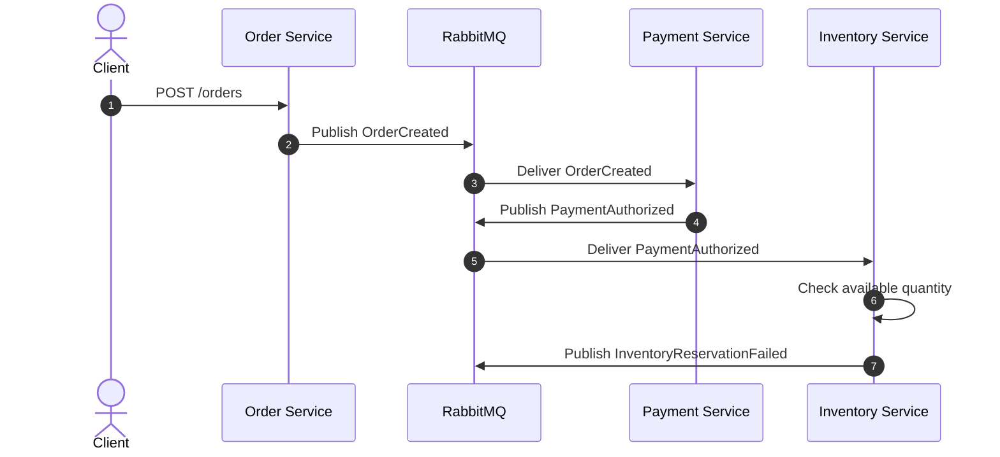
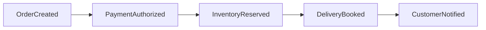

<div align="center">

# CommerceFlow

### Event-driven commerce backend built with TypeScript, RabbitMQ and independently running services

**Node.js · TypeScript · RabbitMQ · Express · Docker · Event-Driven Architecture**

[Overview](#overview) ·
[Architecture](#architecture) ·
[Getting started](#getting-started) ·
[Event flow](#event-flow) ·
[Engineering decisions](#engineering-decisions) ·
[Roadmap](#roadmap)

</div>

---

## Overview

CommerceFlow is a backend demonstration project that explores how independently running services can collaborate through asynchronous events.

The system models a simplified commerce workflow:

1. An order is created.
2. Payment is authorized.
3. Inventory attempts to reserve the requested stock.
4. The reservation either succeeds or fails.

Instead of connecting the services through direct HTTP dependencies, CommerceFlow publishes domain events through RabbitMQ. Each service reacts only to the events relevant to its own responsibility.

The project focuses on service boundaries, asynchronous communication, reliability and maintainability rather than on building a complete e-commerce platform.

---

## Why this project exists

Commerce systems often contain workflows that cross several technical and business boundaries.

A single order can involve:

* Order registration
* Payment processing
* Inventory management
* Delivery planning
* Customer notifications
* Auditing
* Failure recovery

Implementing all of this inside one tightly coupled application can make the system difficult to change and scale.

CommerceFlow demonstrates an alternative approach where:

* Each service owns a clearly defined responsibility.
* Services do not need direct knowledge of one another.
* Communication happens through versioned events.
* Shared messaging infrastructure is isolated behind reusable abstractions.
* Failures can be handled without blocking the complete workflow.

This repository is deliberately kept small enough to understand while still demonstrating patterns used in larger distributed systems.

---

## What the project demonstrates

| Area              | Demonstrated concept                               |
| ----------------- | -------------------------------------------------- |
| Architecture      | Event-driven microservices                         |
| Communication     | Asynchronous messaging through RabbitMQ            |
| Service design    | Independent service responsibilities               |
| Contracts         | Shared and typed event contracts                   |
| Reliability       | Connection retry and dead-letter handling          |
| Consistency       | Idempotent message processing                      |
| Routing           | Topic-based event routing                          |
| Development       | TypeScript monorepo with npm workspaces            |
| Local environment | RabbitMQ through Docker Compose                    |
| API               | Express-based HTTP endpoints                       |
| Maintainability   | Shared messaging package and centralized contracts |

---

## Architecture



### Architectural direction

CommerceFlow separates the system into business-focused services rather than technical layers shared by the entire application.

Each service:

* Runs as an independent Node.js process.
* Owns its own business responsibility.
* Subscribes only to relevant events.
* Publishes the result of its work as a new event.
* Uses shared infrastructure without sharing business logic.
* Can evolve independently within the boundaries of its event contracts.

---

## Services

### Order Service

**Default port:** `3001`

The Order Service is the entry point for the demo workflow.

Responsibilities:

* Exposes the order HTTP endpoint.
* Validates incoming order data.
* Creates the order identifier.
* Registers the new order.
* Publishes `OrderCreated`.

The service does not contact the Payment Service directly. Once the event has been published, the Order Service has completed its immediate responsibility.

---

### Payment Service

**Default port:** `3002`

The Payment Service reacts to newly created orders.

Responsibilities:

* Subscribes to `OrderCreated`.
* Simulates payment authorization.
* Produces a payment result.
* Publishes `PaymentAuthorized`.
* Avoids processing the same message more than once.

Payment processing is intentionally simulated. The purpose of the service is to demonstrate event handling and service collaboration rather than integration with a real payment provider.

---

### Inventory Service

**Default port:** `3003`

The Inventory Service owns the available stock used by the demo.

Responsibilities:

* Subscribes to `PaymentAuthorized`.
* Checks whether the requested quantity is available.
* Reserves stock when sufficient inventory exists.
* Rejects the reservation when inventory is insufficient.
* Publishes either `InventoryReserved` or `InventoryReservationFailed`.
* Exposes the current stock through `GET /stock`.

The current implementation uses in-memory inventory. This keeps the example focused on messaging and workflow design.

---

## Event flow

### Successful reservation



### Failed reservation



---

## Events

The services communicate through the `commerce.events` exchange.

| Routing key                    | Event                        | Publisher         | Consumer          |
| ------------------------------ | ---------------------------- | ----------------- | ----------------- |
| `order.created`                | `OrderCreated`               | Order Service     | Payment Service   |
| `payment.authorized`           | `PaymentAuthorized`          | Payment Service   | Inventory Service |
| `inventory.reserved`           | `InventoryReserved`          | Inventory Service | Future consumers  |
| `inventory.reservation.failed` | `InventoryReservationFailed` | Inventory Service | Future consumers  |

### Example event progression

```text
OrderCreated
    ↓
PaymentAuthorized
    ↓
InventoryReserved
```

Or, when stock is insufficient:

```text
OrderCreated
    ↓
PaymentAuthorized
    ↓
InventoryReservationFailed
```

Events represent facts that have already occurred. Their names are therefore written in the past tense.

---

## Reliability

Distributed systems introduce failure scenarios that do not exist in the same way inside a single process.

CommerceFlow includes reliability mechanisms intended to make those scenarios visible and manageable.

### RabbitMQ connection retry

A service may start before RabbitMQ is ready.

Instead of failing permanently on the first unsuccessful connection attempt, the messaging layer retries the connection. This is particularly relevant when the complete environment is started through Docker or several local processes.

### Dead-letter handling

Messages that cannot be processed successfully should not disappear silently.

Dead-letter handling provides a separate destination for messages that have exhausted their allowed processing attempts or cannot be handled by the normal consumer flow.

This allows failed messages to be:

* Inspected
* Logged
* Diagnosed
* Replayed manually
* Handled by future operational tooling

### Idempotent message handling

RabbitMQ can redeliver a message when a consumer fails before acknowledging it.

A consumer must therefore assume that the same event may arrive more than once.

Idempotent handling prevents a duplicate delivery from producing duplicate business effects, such as:

* Authorizing the same payment twice
* Reserving the same stock twice
* Sending the same notification repeatedly

The current implementation demonstrates this principle within the scope of the demo. A production implementation would normally persist processed message identifiers in durable storage.

### Message acknowledgement

A message should only be acknowledged after the consumer has completed its processing successfully.

Conceptually:

```text
Receive message
    ↓
Validate message
    ↓
Check idempotency
    ↓
Perform business operation
    ↓
Publish resulting event
    ↓
Mark message as processed
    ↓
Acknowledge message
```

If processing fails before acknowledgement, the broker can redeliver or dead-letter the message according to the configured policy.

---

## Repository structure

```text
commerce-flow/
├── packages/
│   ├── contracts/
│   │   └── Shared event contracts and routing keys
│   │
│   └── messaging/
│       └── Shared RabbitMQ connection, publishing and consuming
│
├── services/
│   ├── order-service/
│   │   └── Order API and OrderCreated publishing
│   │
│   ├── payment-service/
│   │   └── Payment processing and PaymentAuthorized publishing
│   │
│   └── inventory-service/
│       └── Stock management and inventory result events
│
├── docker-compose.yml
├── package.json
├── tsconfig.base.json
└── README.md
```

### Workspace responsibilities

| Workspace                          | Responsibility                                    |
| ---------------------------------- | ------------------------------------------------- |
| `@commerce-flow/contracts`         | Event types, payload definitions and routing keys |
| `@commerce-flow/messaging`         | RabbitMQ infrastructure shared by the services    |
| `@commerce-flow/order-service`     | Order creation and order events                   |
| `@commerce-flow/payment-service`   | Payment authorization and payment events          |
| `@commerce-flow/inventory-service` | Stock reservation and inventory events            |

The shared packages contain technical building blocks and communication contracts. Business behaviour remains inside the individual services.

---

## Technology stack

### Runtime and language

* Node.js
* TypeScript
* npm workspaces

### APIs

* Express
* JSON over HTTP

### Messaging

* RabbitMQ
* Topic exchange
* Durable queues
* Explicit routing keys
* Message acknowledgement
* Dead-letter handling

### Local infrastructure

* Docker
* Docker Compose
* RabbitMQ Management UI

### Development quality

* Shared TypeScript configuration
* Type checking
* Typed event contracts
* Centralized messaging abstractions
* Independently running services

---

## Getting started

### Prerequisites

Install the following tools:

* Node.js using a current LTS release
* npm
* Docker Desktop or another Docker-compatible runtime
* Git

Verify the installations:

```bash
node --version
npm --version
docker --version
docker compose version
git --version
```

---

### 1. Clone the repository

```bash
git clone <repository-url>
cd commerce-flow
```

Replace `<repository-url>` with the repository URL from GitHub.

---

### 2. Install dependencies

Run this command from the repository root:

```bash
npm install
```

npm installs the dependencies for the root project and all configured workspaces.

---

### 3. Start RabbitMQ

```bash
docker compose up -d
```

Check that the container is running:

```bash
docker compose ps
```

View the RabbitMQ container logs when needed:

```bash
docker compose logs -f
```

The RabbitMQ Management UI is normally available at:

```text
http://localhost:15672
```

The local development credentials are defined in `docker-compose.yml`.

Do not reuse local demo credentials in a deployed environment.

---

### 4. Start the services

Open three terminals in the repository root.

#### Terminal 1 — Order Service

```bash
npm run dev:order
```

#### Terminal 2 — Payment Service

```bash
npm run dev:payment
```

#### Terminal 3 — Inventory Service

```bash
npm run dev:inventory
```

Expected local endpoints:

| Service             | Address                  |
| ------------------- | ------------------------ |
| Order Service       | `http://localhost:3001`  |
| Payment Service     | `http://localhost:3002`  |
| Inventory Service   | `http://localhost:3003`  |
| RabbitMQ Management | `http://localhost:15672` |

---

## Running the demo

### 1. Inspect the initial stock

Using curl:

```bash
curl http://localhost:3003/stock
```

Using PowerShell:

```powershell
Invoke-RestMethod `
    -Uri "http://localhost:3003/stock" `
    -Method Get
```

The demo inventory includes products such as:

```text
washing-machine-01
dishwasher-01
dryer-01
```

---

### 2. Create an order

Example request:

```bash
curl --request POST http://localhost:3001/orders \
  --header "Content-Type: application/json" \
  --data '{
    "customerId": "customer-001",
    "productId": "washing-machine-01",
    "quantity": 1
  }'
```

PowerShell equivalent:

```powershell
$body = @{
    customerId = "customer-001"
    productId  = "washing-machine-01"
    quantity   = 1
} | ConvertTo-Json

Invoke-RestMethod `
    -Uri "http://localhost:3001/orders" `
    -Method Post `
    -ContentType "application/json" `
    -Body $body
```

After the request, follow the terminal output from all three services.

The expected event progression is:

```text
Order Service
└── publishes OrderCreated

Payment Service
└── consumes OrderCreated
    └── publishes PaymentAuthorized

Inventory Service
└── consumes PaymentAuthorized
    └── publishes InventoryReserved
```

---

### 3. Verify the updated stock

```bash
curl http://localhost:3003/stock
```

The available quantity for the ordered product should have decreased.

---

### 4. Test insufficient inventory

Create an order with a quantity greater than the available stock:

```bash
curl --request POST http://localhost:3001/orders \
  --header "Content-Type: application/json" \
  --data '{
    "customerId": "customer-002",
    "productId": "dryer-01",
    "quantity": 99
  }'
```

The expected result is:

```text
InventoryReservationFailed
```

The inventory quantity must remain unchanged when the reservation fails.

---

## Type checking

Run TypeScript verification across the project:

```bash
npm run typecheck
```

Type checking helps detect:

* Invalid event payloads
* Incorrect imports
* Contract mismatches
* Missing properties
* Invalid function arguments
* Incompatible return types

A successful result confirms that the TypeScript workspaces agree on the current contracts.

Type checking does not replace automated behavioural tests. Unit and integration test coverage are included in the project roadmap.

---

## Engineering decisions

### Why asynchronous events?

Direct HTTP communication would make the services depend on one another’s availability and API structure.

Events reduce this coupling.

The Order Service only needs to know how to publish `OrderCreated`. It does not need to know:

* Where the Payment Service is running
* Which HTTP endpoint the Payment Service exposes
* How the Payment Service is implemented
* Whether additional consumers also use the event

This makes it possible to add future consumers without changing the original publisher.

---

### Why RabbitMQ?

RabbitMQ provides the messaging capabilities required by the project without introducing unnecessary infrastructure complexity.

Relevant features include:

* Exchanges
* Queues
* Routing keys
* Consumer acknowledgements
* Message redelivery
* Durable messaging
* Dead-letter exchanges
* Local management interface

RabbitMQ is therefore a suitable choice for demonstrating asynchronous service communication and failure handling.

---

### Why a topic exchange?

A topic exchange routes messages through explicit routing keys such as:

```text
order.created
payment.authorized
inventory.reserved
inventory.reservation.failed
```

This naming structure makes the event category and outcome visible while allowing consumers to subscribe to either exact events or broader routing patterns.

Examples:

```text
inventory.reserved
inventory.reservation.failed
inventory.*
```

---

### Why shared contracts?

Without shared contracts, the publisher and consumer could silently disagree about an event payload.

The contracts package provides:

* Consistent event names
* Consistent routing keys
* Shared TypeScript payload types
* Compile-time feedback when contracts change

The package contains communication definitions, not shared business logic.

This distinction is important because sharing domain behaviour across services would reduce their independence.

---

### Why a shared messaging package?

RabbitMQ connection and channel management are infrastructure concerns.

Centralizing them avoids duplicating code for:

* Broker connections
* Retry behaviour
* Exchange declaration
* Queue declaration
* Publishing
* Consuming
* Acknowledgement
* Error handling
* Dead-letter configuration

The services depend on a reusable messaging abstraction while keeping their domain behaviour local.

---

### Why a monorepo?

The monorepo keeps a small demonstration project easy to install, run and inspect.

Benefits include:

* One dependency installation
* Shared TypeScript configuration
* Atomic contract changes
* Consistent development scripts
* Easier local development
* A complete event flow in one repository

The services remain independently runnable even though their source code is stored together.

For a larger organization, separate repositories could be considered when service ownership, release cycles or access boundaries require it.

---

### Why in-memory state?

Inventory is currently stored in memory to keep the project focused on event-driven architecture.

This is an intentional limitation rather than a recommended production design.

A durable production implementation would require:

* Persistent storage
* Database transactions
* Concurrency control
* Optimistic or pessimistic locking
* Durable idempotency records
* Recovery after service restarts

---

## Design principles

### Clear service boundaries

A service should own one coherent business responsibility.

### Loose coupling

Services communicate through contracts rather than implementation details.

### Explicit events

Published events describe facts that have occurred.

### Idempotent consumers

Duplicate delivery must not create duplicate business effects.

### Infrastructure isolation

Messaging-specific code is kept outside the core service behaviour.

### Observable behaviour

Important actions and failures should be visible through structured logs and operational tooling.

### Incremental evolution

The project is developed through focused architectural improvements instead of being presented as an unexplained finished code dump.

---

## Current limitations

CommerceFlow is an architectural demonstration, not a production-ready commerce platform.

The current scope does not yet include:

* Durable business data
* Real payment integration
* Authentication or authorization
* API rate limiting
* Distributed tracing
* Centralized metrics
* Centralized log aggregation
* Schema registry
* Transactional outbox
* Automated end-to-end tests
* Kubernetes deployment
* Production secret management

Documenting these limitations is important because event-driven systems require more than a message broker to operate reliably in production.

---

## Production considerations

Before applying this architecture to a production system, the following areas should be addressed.

### Transactional outbox

A database update and an event publication cannot normally be committed as one atomic operation.

Without an outbox, a service can:

1. Save its business state.
2. Fail before publishing the event.
3. Leave downstream services unaware of the completed change.

A transactional outbox would persist the domain change and the outgoing event in the same database transaction.

---

### Durable idempotency

Processed message identifiers should be stored in persistent storage.

An in-memory idempotency record is lost when the service restarts.

---

### Event versioning

Contracts must evolve without unexpectedly breaking existing consumers.

A future version should define rules for:

* Backward-compatible additions
* Breaking changes
* Event version numbers
* Consumer migration
* Deprecated event contracts

---

### Observability

A distributed workflow should support correlation across service boundaries.

A production-oriented version would include:

* Correlation identifiers
* Structured logging
* OpenTelemetry
* Distributed traces
* Service metrics
* Queue depth metrics
* Dead-letter alerts
* Health and readiness checks

---

### Security

A deployed environment should include:

* Secret management
* TLS
* Broker access control
* Restricted management access
* Input validation
* Authentication
* Authorization
* Dependency scanning
* Container image scanning

---

## Roadmap

### Current foundation

* [x] TypeScript monorepo
* [x] Shared event contracts
* [x] Shared RabbitMQ package
* [x] Order Service
* [x] Payment Service
* [x] Inventory Service
* [x] Topic-based routing
* [x] RabbitMQ connection retry
* [x] Dead-letter handling
* [x] Idempotent message processing
* [x] Docker Compose environment
* [x] TypeScript type checking

### Next improvements

* [ ] Add unit tests for service-level business logic
* [ ] Add RabbitMQ integration tests
* [ ] Add automated end-to-end workflow tests
* [ ] Add service health endpoints
* [ ] Add structured logging
* [ ] Add correlation identifiers
* [ ] Add Notification Service
* [ ] Add Delivery Service
* [ ] Add GitHub Actions build and type-check workflow
* [ ] Add automated dependency updates

### Advanced reliability

* [ ] Add PostgreSQL persistence
* [ ] Add transactional outbox
* [ ] Add durable inbox and idempotency storage
* [ ] Add retry queues with controlled delays
* [ ] Add message replay tooling
* [ ] Add event contract versioning
* [ ] Add compensating actions
* [ ] Explore saga orchestration and choreography

### Observability and deployment

* [ ] Add OpenTelemetry instrumentation
* [ ] Add distributed tracing
* [ ] Add Prometheus metrics
* [ ] Add Grafana dashboards
* [ ] Add container health checks
* [ ] Add Kubernetes manifests
* [ ] Add production deployment documentation

---

## Suggested future workflow

A future version of CommerceFlow can extend the current event chain:



The important architectural property is that each new capability can be introduced as a consumer without requiring the Order Service to coordinate the entire workflow directly.

---

## Useful commands

### Install dependencies

```bash
npm install
```

### Start RabbitMQ

```bash
docker compose up -d
```

### Stop RabbitMQ

```bash
docker compose down
```

### Stop RabbitMQ and remove local volumes

```bash
docker compose down --volumes
```

### View RabbitMQ logs

```bash
docker compose logs -f
```

### Start Order Service

```bash
npm run dev:order
```

### Start Payment Service

```bash
npm run dev:payment
```

### Start Inventory Service

```bash
npm run dev:inventory
```

### Run type checking

```bash
npm run typecheck
```

---

## Troubleshooting

### A service cannot connect to RabbitMQ

Check whether the RabbitMQ container is running:

```bash
docker compose ps
```

Inspect its logs:

```bash
docker compose logs rabbitmq
```

Restart the environment:

```bash
docker compose down
docker compose up -d
```

---

### A port is already in use

Check whether another process is using one of the service ports:

```text
3001
3002
3003
15672
5672
```

Stop the conflicting process or change the local port configuration.

---

### Messages are published but not consumed

Check:

1. Whether all services are running.
2. Whether RabbitMQ is available.
3. Whether the expected queues have been declared.
4. Whether bindings use the correct routing keys.
5. Whether failed messages were routed to a dead-letter queue.
6. Whether the consumer logs show a validation or processing error.

---

### Inventory resets after restart

This is expected in the current demo because stock is stored in memory.

Persistent inventory is planned as a future improvement.

---

## Learning outcomes

CommerceFlow demonstrates practical understanding of:

* Decomposing a workflow into service responsibilities
* Designing asynchronous event flows
* Defining shared event contracts
* Using RabbitMQ exchanges, queues and routing keys
* Handling connection failures
* Planning for duplicate message delivery
* Separating infrastructure from business behaviour
* Evaluating consistency and reliability trade-offs
* Identifying the gaps between a demo and a production system

---

## Project status

CommerceFlow is under active development as a portfolio and architectural learning project.

The current version demonstrates the central order-to-inventory event flow. Planned iterations will focus on automated testing, observability, durable persistence and stronger delivery guarantees.

---

## Author

Created by **Kris Riisgaard Larsen**.

The project is part of a software development portfolio focused on backend engineering, integrations, distributed systems and maintainable application architecture.
