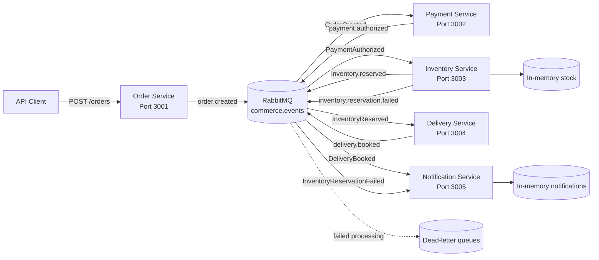
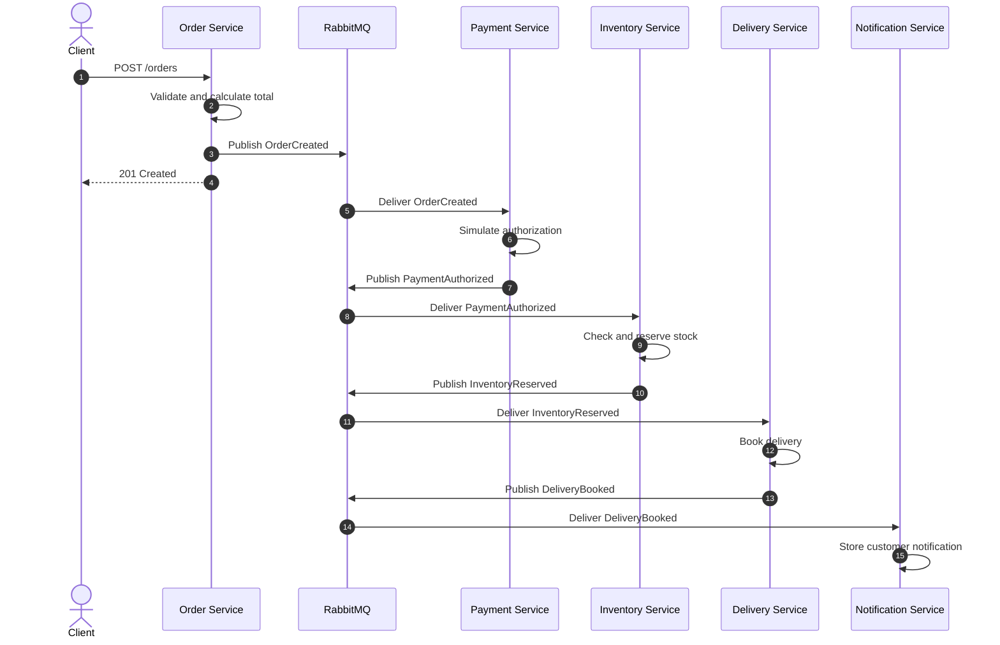
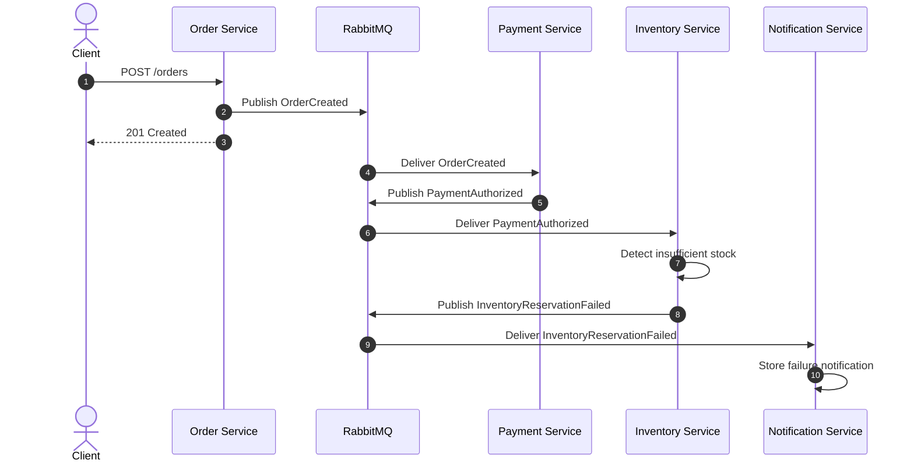

<div align="center">

# CommerceFlow

### Event-driven commerce workflow built with TypeScript, RabbitMQ and independently running services

**Node.js · TypeScript · RabbitMQ · Express · Docker · npm Workspaces**

[Overview](#overview) ·
[Architecture](#architecture) ·
[Services](#services) ·
[Getting started](#getting-started) ·
[Running the demo](#running-the-demo) ·
[Reliability](#reliability) ·
[Roadmap](#roadmap)

</div>

---

## Overview

CommerceFlow is an event-driven backend demonstration project that shows how independently running services can collaborate through asynchronous events.

The system models a simplified commerce workflow:

1. An order is created.
2. Payment is authorized.
3. Inventory attempts to reserve the requested products.
4. A delivery is booked when the reservation succeeds.
5. A customer notification is created.
6. An alternative notification is created if the inventory reservation fails.

The services do not communicate through direct service-to-service HTTP calls.

Instead, they publish and consume domain events through RabbitMQ. Each service only understands the events relevant to its own responsibility.

The project focuses on:

* Service boundaries
* Asynchronous communication
* Event contracts
* Reliability
* Loose coupling
* Failure handling
* Maintainable infrastructure abstractions

CommerceFlow is deliberately small enough to understand while still demonstrating patterns used in larger distributed systems.

---

## Why this project exists

Commerce workflows often cross several business and technical boundaries.

A single order can involve:

* Order registration
* Payment processing
* Inventory reservation
* Delivery planning
* Customer communication
* Auditing
* Failure recovery

A tightly coupled implementation can cause every service to depend directly on the availability, endpoint structure and implementation details of the next service.

CommerceFlow demonstrates another approach:

* Each service owns one clear business responsibility.
* Services communicate through typed events.
* Publishers do not need to know which consumers exist.
* New consumers can be added without changing existing publishers.
* Failed messages can be moved to dead-letter queues.
* Duplicate event deliveries can be detected.
* A correlation identifier follows the complete workflow.

---

## Current workflow

### Successful order

```text
OrderCreated
    ↓
PaymentAuthorized
    ↓
InventoryReserved
    ↓
DeliveryBooked
    ↓
Customer notification stored
```

### Insufficient inventory

```text
OrderCreated
    ↓
PaymentAuthorized
    ↓
InventoryReservationFailed
    ↓
Customer notification stored
```

The Notification Service currently stores notifications in memory. It does not publish a separate `CustomerNotified` domain event.

---

## What the project demonstrates

| Area                 | Demonstrated concept                           |
| -------------------- | ---------------------------------------------- |
| Architecture         | Event-driven services                          |
| Communication        | Asynchronous RabbitMQ messaging                |
| Contracts            | Shared and typed TypeScript event definitions  |
| Routing              | Topic exchange and explicit routing keys       |
| Reliability          | Connection retry and dead-letter handling      |
| Consistency          | Idempotent event processing                    |
| Traceability         | Correlation identifiers across services        |
| Service design       | Independent business responsibilities          |
| API design           | Express-based HTTP endpoints                   |
| Development          | TypeScript monorepo using npm workspaces       |
| Local infrastructure | RabbitMQ through Docker Compose                |
| Automation           | GitHub Actions validation on Node.js 20 and 22 |

---

## Architecture



### Architectural direction

Each service:

* Runs as an independent Node.js process.
* Owns one focused business responsibility.
* Subscribes only to relevant events.
* Publishes the result of its work as a new event when required.
* Preserves the workflow correlation identifier.
* Uses shared messaging infrastructure without sharing business behaviour.
* Can evolve independently within the boundaries of its event contracts.

---

## Services

## Order Service

**Default port:** `3001`

The Order Service is the HTTP entry point for the workflow.

### Responsibilities

* Exposes `POST /orders`.
* Exposes `GET /health`.
* Validates incoming order requests.
* Generates the order identifier.
* Calculates the total order amount.
* Reads or creates a correlation identifier.
* Publishes `OrderCreated`.
* Returns the created order information to the client.

### Endpoints

| Method | Endpoint  | Purpose                                        |
| ------ | --------- | ---------------------------------------------- |
| `GET`  | `/health` | Returns service health information             |
| `POST` | `/orders` | Creates an order and starts the event workflow |

The service does not call the Payment Service directly. Its responsibility ends when the order has been created and the event has been published.

---

## Payment Service

**Default port:** `3002`

The Payment Service reacts to new orders.

### Responsibilities

* Exposes `GET /health`.
* Subscribes to `OrderCreated`.
* Simulates payment authorization.
* Creates a payment identifier.
* Preserves the original order items.
* Publishes `PaymentAuthorized`.

### Endpoints

| Method | Endpoint  | Purpose                            |
| ------ | --------- | ---------------------------------- |
| `GET`  | `/health` | Returns service health information |

Payment authorization is deliberately simulated. The purpose is to demonstrate service collaboration and event handling rather than integration with a real payment provider.

---

## Inventory Service

**Default port:** `3003`

The Inventory Service owns the current demo stock.

### Responsibilities

* Exposes `GET /health`.
* Exposes `GET /stock`.
* Subscribes to `PaymentAuthorized`.
* Checks every requested order item.
* Reserves stock when all products are available.
* Leaves stock unchanged when any item is unavailable.
* Publishes `InventoryReserved` on success.
* Publishes `InventoryReservationFailed` on failure.

### Endpoints

| Method | Endpoint  | Purpose                             |
| ------ | --------- | ----------------------------------- |
| `GET`  | `/health` | Returns service health information  |
| `GET`  | `/stock`  | Returns the current in-memory stock |

### Initial stock

| Product              | Quantity |
| -------------------- | -------: |
| `washing-machine-01` |       10 |
| `dishwasher-01`      |        5 |
| `dryer-01`           |        3 |

Inventory is currently stored in memory and is reset whenever the service restarts.

---

## Delivery Service

**Default port:** `3004`

The Delivery Service reacts to successful inventory reservations.

### Responsibilities

* Exposes `GET /health`.
* Subscribes to `InventoryReserved`.
* Creates a delivery identifier.
* Selects a simulated carrier.
* Calculates an estimated delivery date.
* Publishes `DeliveryBooked`.

### Endpoints

| Method | Endpoint  | Purpose                            |
| ------ | --------- | ---------------------------------- |
| `GET`  | `/health` | Returns service health information |

The current implementation uses `DefaultCarrier` and calculates the estimated delivery date as three days after the booking date.

This is intentionally simple because the project focuses on event flow rather than integration with a real shipping provider.

---

## Notification Service

**Default port:** `3005`

The Notification Service creates customer-facing notification records based on workflow outcomes.

### Responsibilities

* Exposes `GET /health`.
* Exposes `GET /notifications`.
* Subscribes to `DeliveryBooked`.
* Subscribes to `InventoryReservationFailed`.
* Creates a success notification when delivery is booked.
* Creates a failure notification when stock cannot be reserved.
* Stores notifications in memory.
* Preserves the workflow correlation identifier.

### Endpoints

| Method | Endpoint         | Purpose                                     |
| ------ | ---------------- | ------------------------------------------- |
| `GET`  | `/health`        | Returns service health information          |
| `GET`  | `/notifications` | Returns all current in-memory notifications |

The current version does not send real email, SMS or push notifications.

---

## Event flow

### Successful workflow



### Failed inventory workflow



---

## Events

All domain events are published through the durable topic exchange:

```text
commerce.events
```

| Routing key                    | Event                        | Publisher         | Consumer             |
| ------------------------------ | ---------------------------- | ----------------- | -------------------- |
| `order.created`                | `OrderCreated`               | Order Service     | Payment Service      |
| `payment.authorized`           | `PaymentAuthorized`          | Payment Service   | Inventory Service    |
| `inventory.reserved`           | `InventoryReserved`          | Inventory Service | Delivery Service     |
| `inventory.reservation.failed` | `InventoryReservationFailed` | Inventory Service | Notification Service |
| `delivery.booked`              | `DeliveryBooked`             | Delivery Service  | Notification Service |

### Shared event envelope

Every event contains:

```ts
interface DomainEvent<TEventType, TData> {
    eventId: string;
    eventType: TEventType;
    occurredAt: string;
    correlationId: string;
    data: TData;
}
```

The envelope provides:

* A unique event identifier
* A typed event name
* A timestamp
* A workflow correlation identifier
* Event-specific data

### Event naming

Events describe facts that have already occurred and are therefore named in the past tense:

```text
OrderCreated
PaymentAuthorized
InventoryReserved
InventoryReservationFailed
DeliveryBooked
```

---

## Correlation identifiers

The Order Service reads an optional correlation identifier from:

```text
x-correlation-id
```

When the request does not contain one, the service generates a new UUID.

The same value is then carried through:

```text
OrderCreated
    ↓
PaymentAuthorized
    ↓
InventoryReserved or InventoryReservationFailed
    ↓
DeliveryBooked
    ↓
Notification record
```

This makes it possible to follow one workflow across several independently running services.

---

## Reliability

Distributed systems introduce failure cases that do not exist in the same way inside a single process.

CommerceFlow includes several mechanisms that make these scenarios visible and manageable.

### RabbitMQ connection retry

A service may start before RabbitMQ is ready.

The shared messaging client retries failed connection attempts instead of failing permanently after the first attempt.

The current defaults are:

```text
Maximum attempts: 10
Delay between attempts: 2000 milliseconds
```

---

### Durable exchange and queues

The main exchange and service queues are declared as durable.

Published messages use persistent delivery mode.

This allows RabbitMQ to preserve the configured messaging topology and makes messages more resilient to broker restarts.

Persistence still depends on the complete RabbitMQ deployment and storage configuration.

---

### Explicit acknowledgements

Messages are acknowledged only after the consumer handler completes successfully.

Conceptually:

```text
Receive message
    ↓
Parse event
    ↓
Validate event identifier
    ↓
Check idempotency
    ↓
Execute handler
    ↓
Publish resulting event when required
    ↓
Mark event as processed
    ↓
Acknowledge message
```

When processing fails, the message is rejected without requeueing and is routed to the queue-specific dead-letter queue.

---

### Dead-letter handling

Each subscriber queue receives its own dead-letter queue.

The naming pattern is:

```text
<queue-name>.dead-letter
```

Examples:

```text
payment-service.order-created.dead-letter
inventory-service.payment-authorized.dead-letter
delivery-service.inventory-reserved.dead-letter
notification-service.customer-events.dead-letter
```

Failed messages can then be:

* Inspected
* Diagnosed
* Logged
* Replayed manually
* Processed by future recovery tooling

---

### Idempotent processing

RabbitMQ may redeliver a message if processing is interrupted before acknowledgement.

The shared messaging client keeps processed event identifiers per queue and acknowledges duplicate events without running the handler again.

This prevents duplicate effects during the current process lifetime, such as:

* Authorizing the same payment twice
* Reserving the same inventory twice
* Booking the same delivery twice
* Creating the same notification twice

The current idempotency store is in memory.

A production implementation should use persistent storage because the in-memory record is lost when a service restarts.

---

## Repository structure

```text
commerce-flow/
├── .github/
│   └── workflows/
│       └── ci.yml
│
├── shared/
│   ├── contracts/
│   │   ├── src/
│   │   │   ├── events.ts
│   │   │   └── index.ts
│   │   ├── package.json
│   │   └── tsconfig.json
│   │
│   └── messaging/
│       ├── src/
│       │   ├── rabbitMqClient.ts
│       │   └── index.ts
│       ├── package.json
│       └── tsconfig.json
│
├── services/
│   ├── order-service/
│   ├── payment-service/
│   ├── inventory-service/
│   ├── delivery-service/
│   └── notification-service/
│
├── docker-compose.yml
├── package.json
├── package-lock.json
├── tsconfig.base.json
└── README.md
```

### Workspace responsibilities

| Workspace                             | Responsibility                                                 |
| ------------------------------------- | -------------------------------------------------------------- |
| `@commerce-flow/contracts`            | Shared event envelopes, payloads and event types               |
| `@commerce-flow/messaging`            | RabbitMQ connection, publishing, subscriptions and reliability |
| `@commerce-flow/order-service`        | Order creation and `OrderCreated` publishing                   |
| `@commerce-flow/payment-service`      | Payment authorization and `PaymentAuthorized` publishing       |
| `@commerce-flow/inventory-service`    | Stock reservation and inventory result events                  |
| `@commerce-flow/delivery-service`     | Delivery booking and `DeliveryBooked` publishing               |
| `@commerce-flow/notification-service` | Customer notification creation for workflow outcomes           |

Shared packages contain technical infrastructure and communication contracts.

Business behaviour remains inside the individual services.

---

## Technology stack

### Runtime and language

* Node.js 20 or newer
* TypeScript
* ECMAScript modules
* npm workspaces

### APIs

* Express
* JSON over HTTP

### Messaging

* RabbitMQ
* Topic exchange
* Durable queues
* Persistent messages
* Explicit routing keys
* Manual acknowledgements
* Dead-letter queues
* Correlation identifiers
* Idempotent consumers

### Local infrastructure

* Docker
* Docker Compose
* RabbitMQ Management UI

### Automation

* GitHub Actions
* Node.js 20 validation
* Node.js 22 validation
* Reproducible installation through `npm ci`
* Type checking
* Workspace builds
* Automatic execution of workspace test scripts when present

---

## Getting started

### Prerequisites

Install:

* Node.js 20 or newer
* npm
* Docker Desktop or another Docker-compatible runtime
* Git

Verify the installations:

```powershell
node --version
npm --version
docker --version
docker compose version
git --version
```

---

### 1. Clone the repository

```powershell
git clone https://github.com/kris7011/commerce-flow.git
cd commerce-flow
```

---

### 2. Install dependencies

```powershell
npm install
```

For a clean installation based strictly on `package-lock.json`:

```powershell
npm ci
```

---

### 3. Start RabbitMQ

```powershell
docker compose up -d
```

Check the running container:

```powershell
docker compose ps
```

RabbitMQ uses:

| Purpose              | Address                  |
| -------------------- | ------------------------ |
| AMQP connection      | `localhost:5672`         |
| Management interface | `http://localhost:15672` |

Default local credentials:

```text
Username: guest
Password: guest
```

These credentials are only suitable for local development.

---

### 4. Start the services

Open five terminals in the repository root.

#### Terminal 1 — Order Service

```powershell
npm run dev:order
```

#### Terminal 2 — Payment Service

```powershell
npm run dev:payment
```

#### Terminal 3 — Inventory Service

```powershell
npm run dev:inventory
```

#### Terminal 4 — Delivery Service

```powershell
npm run dev:delivery
```

#### Terminal 5 — Notification Service

```powershell
npm run dev:notification
```

### Local service addresses

| Service              | Address                  |
| -------------------- | ------------------------ |
| Order Service        | `http://localhost:3001`  |
| Payment Service      | `http://localhost:3002`  |
| Inventory Service    | `http://localhost:3003`  |
| Delivery Service     | `http://localhost:3004`  |
| Notification Service | `http://localhost:3005`  |
| RabbitMQ Management  | `http://localhost:15672` |

---

## Health checks

Check all services from PowerShell:

```powershell
Invoke-RestMethod -Uri "http://localhost:3001/health"
Invoke-RestMethod -Uri "http://localhost:3002/health"
Invoke-RestMethod -Uri "http://localhost:3003/health"
Invoke-RestMethod -Uri "http://localhost:3004/health"
Invoke-RestMethod -Uri "http://localhost:3005/health"
```

A healthy service returns a response similar to:

```json
{
  "status": "Healthy",
  "service": "order-service"
}
```

The health endpoints currently confirm that the HTTP process is running.

They do not yet verify all downstream dependencies such as RabbitMQ connectivity.

---

## Running the demo

## Successful order

### 1. Inspect the initial stock

```powershell
Invoke-RestMethod `
    -Uri "http://localhost:3003/stock" `
    -Method Get
```

Expected initial stock:

```json
{
  "stock": {
    "washing-machine-01": 10,
    "dishwasher-01": 5,
    "dryer-01": 3
  }
}
```

### 2. Create an order

```powershell
$body = @{
    customerId = "customer-001"
    items = @(
        @{
            productId = "washing-machine-01"
            quantity = 1
            unitPrice = 4999.00
        }
    )
} | ConvertTo-Json -Depth 4

$orderResponse = Invoke-RestMethod `
    -Uri "http://localhost:3001/orders" `
    -Method Post `
    -ContentType "application/json" `
    -Headers @{
        "x-correlation-id" = "demo-success-001"
    } `
    -Body $body

$orderResponse
```

Expected response structure:

```json
{
  "orderId": "generated-order-id",
  "status": "Created",
  "totalAmount": 4999,
  "correlationId": "demo-success-001"
}
```

### 3. Follow the service logs

The expected progression is:

```text
Order Service
└── publishes OrderCreated

Payment Service
└── consumes OrderCreated
    └── publishes PaymentAuthorized

Inventory Service
└── consumes PaymentAuthorized
    └── publishes InventoryReserved

Delivery Service
└── consumes InventoryReserved
    └── publishes DeliveryBooked

Notification Service
└── consumes DeliveryBooked
    └── stores customer notification
```

### 4. Verify the updated stock

```powershell
Invoke-RestMethod `
    -Uri "http://localhost:3003/stock" `
    -Method Get
```

The quantity of `washing-machine-01` should now be `9`.

### 5. Inspect notifications

```powershell
Invoke-RestMethod `
    -Uri "http://localhost:3005/notifications" `
    -Method Get
```

The result should contain a delivery notification with:

* The generated order identifier
* `DeliveryBooked` as its type
* `DefaultCarrier`
* The estimated delivery date
* The original correlation identifier

---

## Failed inventory reservation

Create an order requesting more units than the current stock contains:

```powershell
$body = @{
    customerId = "customer-002"
    items = @(
        @{
            productId = "dryer-01"
            quantity = 99
            unitPrice = 2999.00
        }
    )
} | ConvertTo-Json -Depth 4

$orderResponse = Invoke-RestMethod `
    -Uri "http://localhost:3001/orders" `
    -Method Post `
    -ContentType "application/json" `
    -Headers @{
        "x-correlation-id" = "demo-failure-001"
    } `
    -Body $body

$orderResponse
```

Expected progression:

```text
OrderCreated
    ↓
PaymentAuthorized
    ↓
InventoryReservationFailed
    ↓
Failure notification stored
```

Inspect the notifications:

```powershell
Invoke-RestMethod `
    -Uri "http://localhost:3005/notifications" `
    -Method Get
```

The failed reservation notification contains:

* The affected order identifier
* `InventoryReservationFailed` as its type
* The failure reason
* Requested and available quantities
* The workflow correlation identifier

The stock remains unchanged when the reservation fails.

---

## Validation commands

### Type checking

```powershell
npm run typecheck
```

This executes the `typecheck` script in every workspace that defines one.

Type checking detects issues such as:

* Invalid event payloads
* Missing event properties
* Incorrect imports
* Contract mismatches
* Invalid function arguments
* Incompatible return types

---

### Build

```powershell
npm run build
```

This compiles all workspaces that define a build script.

---

### Tests

```powershell
npm test
```

The root command executes test scripts in workspaces where they exist.

Automated behavioural tests have not yet been implemented, so the current command may complete without executing test cases.

Tests are included in the roadmap.

---

### Dependency audit

```powershell
npm audit
```

The repository currently uses a patched `body-parser` dependency and should report no known vulnerabilities for the installed dependency tree.

---

## Continuous integration

The GitHub Actions workflow is located at:

```text
.github/workflows/ci.yml
```

It runs for:

* Pushes to `main`
* Pull requests targeting `main`
* Manual workflow execution

The workflow validates the project on:

```text
Node.js 20.x
Node.js 22.x
```

Each matrix job performs:

```text
npm ci
    ↓
npm run typecheck
    ↓
npm run build
    ↓
npm test
```

The jobs use:

* Read-only repository permissions
* npm dependency caching
* A ten-minute timeout
* Cancellation of outdated workflow runs on the same reference
* Independent reporting for both Node.js versions

---

## Engineering decisions

### Why asynchronous events?

Direct HTTP communication would make each service depend on:

* The next service being online
* The next service’s network location
* Its HTTP endpoint structure
* Its response format
* Its implementation details

With events, the Order Service only needs to know how to publish `OrderCreated`.

It does not need to know:

* Where the Payment Service runs
* Whether the Payment Service is currently available
* Which other consumers use the same event
* How payment authorization is implemented

---

### Why RabbitMQ?

RabbitMQ provides the messaging capabilities required by the project without introducing excessive infrastructure complexity.

Relevant features include:

* Exchanges
* Queues
* Topic routing
* Durable topology
* Message acknowledgement
* Redelivery
* Dead-letter exchanges
* Persistent messages
* A local management interface

---

### Why a topic exchange?

The topic exchange routes events through explicit routing keys:

```text
order.created
payment.authorized
inventory.reserved
inventory.reservation.failed
delivery.booked
```

This makes the business meaning visible and allows consumers to subscribe to exact events or broader patterns.

Example:

```text
inventory.*
```

---

### Why shared contracts?

Without shared contracts, publishers and consumers could silently disagree about event payloads.

The contracts workspace provides:

* Shared event names
* Shared TypeScript payload types
* A consistent event envelope
* Compile-time feedback when a contract changes

It contains communication definitions, not shared business behaviour.

---

### Why a shared messaging package?

RabbitMQ connection and channel management are infrastructure concerns.

The messaging workspace centralizes:

* Connection retry
* Exchange creation
* Queue creation
* Queue binding
* Message publication
* Message consumption
* Acknowledgement
* Dead-letter configuration
* Duplicate event detection
* Connection shutdown

This avoids duplicating the same infrastructure code in every service.

---

### Why a monorepo?

The monorepo keeps the demonstration easy to install, run and inspect.

Benefits include:

* One dependency installation
* Shared TypeScript configuration
* Atomic contract changes
* Consistent scripts
* Easier local development
* One repository containing the complete workflow

The services still run as separate processes.

---

### Why in-memory storage?

Inventory, processed event identifiers and notifications are currently stored in memory.

This keeps the project focused on messaging and service collaboration.

It is an intentional limitation rather than a recommended production design.

A production implementation would require:

* Persistent databases
* Transactions
* Concurrency control
* Durable idempotency records
* Recovery after restarts
* Data migrations
* Backup and restore procedures

---

## Current limitations

CommerceFlow is an architectural demonstration rather than a production-ready commerce platform.

The current implementation does not yet include:

* Persistent business data
* Durable idempotency
* Real payment integration
* Real carrier integration
* Real email, SMS or push notifications
* Authentication
* Authorization
* Rate limiting
* Transactional outbox
* Event schema versioning
* Distributed tracing
* Centralized metrics
* Centralized log aggregation
* Automated behavioural tests
* Retry queues with delayed retries
* Production secret management
* Kubernetes deployment

---

## Production considerations

### Transactional outbox

A database transaction and a RabbitMQ publication cannot normally be committed atomically.

Without an outbox, a service can:

1. Save its business state.
2. Fail before publishing its event.
3. Leave downstream services unaware of the completed change.

A transactional outbox would store the business change and outgoing event in the same database transaction.

---

### Durable idempotency

Processed event identifiers should be stored in persistent storage.

The current in-memory implementation loses its state whenever a service restarts.

---

### Event versioning

Contracts must be able to evolve without unexpectedly breaking existing consumers.

A future version should define rules for:

* Backward-compatible additions
* Breaking changes
* Event version numbers
* Consumer migrations
* Deprecated event contracts

---

### Observability

A production-oriented version should include:

* Structured JSON logging
* OpenTelemetry
* Distributed traces
* Service metrics
* Queue depth monitoring
* Dead-letter alerts
* Readiness checks
* Dependency-aware health checks

---

### Security

A deployed environment should include:

* Secret management
* TLS
* Restricted RabbitMQ accounts
* Restricted management interface access
* Authentication
* Authorization
* Request size limits
* Dependency scanning
* Container image scanning

---

## Roadmap

### Current foundation

* [x] TypeScript monorepo
* [x] npm workspaces
* [x] Shared event contracts
* [x] Shared RabbitMQ client
* [x] Order Service
* [x] Payment Service
* [x] Inventory Service
* [x] Delivery Service
* [x] Notification Service
* [x] Topic-based event routing
* [x] Correlation identifiers
* [x] RabbitMQ connection retry
* [x] Queue-specific dead-letter handling
* [x] In-memory idempotent message handling
* [x] Health endpoints for all services
* [x] Docker Compose environment
* [x] Type checking
* [x] Workspace builds
* [x] GitHub Actions validation
* [x] Node.js 20 and 22 CI matrix
* [x] Dependency vulnerability remediation

### Next improvements

* [ ] Add unit tests for service business logic
* [ ] Add RabbitMQ integration tests
* [ ] Add end-to-end workflow tests
* [ ] Separate HTTP setup from service startup
* [ ] Add request validation library
* [ ] Add structured logging
* [ ] Add dependency-aware readiness endpoints
* [ ] Add persistent inventory storage
* [ ] Add persistent notification storage
* [ ] Add persistent idempotency records
* [ ] Add retry queues with controlled delays

### Advanced reliability

* [ ] Add PostgreSQL
* [ ] Add transactional outbox
* [ ] Add transactional inbox
* [ ] Add message replay tooling
* [ ] Add event contract versioning
* [ ] Add compensating actions
* [ ] Explore saga orchestration
* [ ] Explore saga choreography

### Observability and deployment

* [ ] Add OpenTelemetry
* [ ] Add distributed tracing
* [ ] Add Prometheus metrics
* [ ] Add Grafana dashboards
* [ ] Add container health checks
* [ ] Add Dockerfiles for all services
* [ ] Add Kubernetes manifests
* [ ] Add deployment documentation

---

## Useful commands

### Install dependencies

```powershell
npm install
```

### Clean dependency installation

```powershell
npm ci
```

### Start RabbitMQ

```powershell
docker compose up -d
```

### View RabbitMQ status

```powershell
docker compose ps
```

### View RabbitMQ logs

```powershell
docker compose logs -f rabbitmq
```

### Stop RabbitMQ

```powershell
docker compose down
```

### Stop RabbitMQ and remove volumes

```powershell
docker compose down --volumes
```

### Start Order Service

```powershell
npm run dev:order
```

### Start Payment Service

```powershell
npm run dev:payment
```

### Start Inventory Service

```powershell
npm run dev:inventory
```

### Start Delivery Service

```powershell
npm run dev:delivery
```

### Start Notification Service

```powershell
npm run dev:notification
```

### Run type checking

```powershell
npm run typecheck
```

### Build all workspaces

```powershell
npm run build
```

### Run workspace tests

```powershell
npm test
```

### Audit dependencies

```powershell
npm audit
```

---

## Troubleshooting

### A service cannot connect to RabbitMQ

Check whether RabbitMQ is running:

```powershell
docker compose ps
```

Inspect the logs:

```powershell
docker compose logs rabbitmq
```

Restart RabbitMQ:

```powershell
docker compose down
docker compose up -d
```

Services retry their RabbitMQ connection automatically during startup.

---

### A port is already in use

Check whether another process is using one of these ports:

```text
3001
3002
3003
3004
3005
5672
15672
```

Stop the conflicting process or override the relevant service port environment variable.

---

### Messages are published but not consumed

Check:

1. Whether all five services are running.
2. Whether RabbitMQ is available.
3. Whether the expected queues have been declared.
4. Whether the queues have the correct routing-key bindings.
5. Whether the consumer logs contain a processing error.
6. Whether the message was moved to a dead-letter queue.
7. Whether the event payload matches the shared contract.

---

### Stock or notifications disappear after restart

This is expected.

The Inventory Service and Notification Service currently use in-memory storage.

Persistent storage is planned as a future improvement.

---

### A duplicate message is processed after restart

The current duplicate-event tracking is stored in memory.

It prevents duplicates while the service process remains running but does not survive a restart.

Durable inbox or idempotency storage is planned.

---

## Learning outcomes

CommerceFlow demonstrates practical experience with:

* Decomposing workflows into service responsibilities
* Designing asynchronous event chains
* Defining typed event contracts
* Using RabbitMQ exchanges, queues and routing keys
* Preserving correlation identifiers
* Handling failed messages through dead-letter queues
* Planning for duplicate message delivery
* Separating infrastructure from business behaviour
* Creating independently running services in a monorepo
* Using GitHub Actions for repeatable validation
* Identifying the differences between a demonstration and a production system

---

## Project status

CommerceFlow is under active development as a portfolio and architectural learning project.

The current version demonstrates a complete event-driven workflow from order creation through payment, inventory, delivery and customer notification.

Future iterations will focus on automated tests, durable persistence, observability and stronger delivery guarantees.

---

## Author

Created by **Kris Riisgaard Larsen**.

CommerceFlow is part of a software development portfolio focused on backend engineering, integrations, distributed systems and maintainable application architecture.
